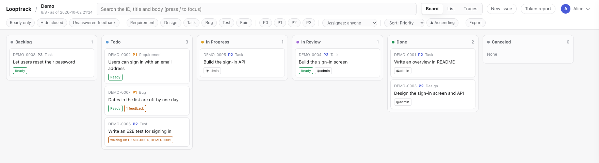

# Looptrack

*日本語版: [README.ja.md](README.ja.md)*

**Looptrack is an issue tracker that serves as external memory for AI coding
agents and makes loop engineering possible.** It records the work items an AI
plans, kept apart from your project's own issues. You can see the plans and
decisions behind them. And it logs the tokens each task consumed, so you can
report on them.

Why does that matter? Four reasons.

- **External memory for AI coding agents.** In vibe coding, an AI remembers only
  what fits in its context window. Anything beyond that, it can't hold. So
  across sessions it sometimes repeats work, or skips work it should have done.
  The answer is a memory kept outside the AI, and Looptrack was built to be
  exactly that: a task memory made for AI. Every session and every agent reads
  the same issues, so what one session decided is still there for the next.
- **Loop engineering, made real.** By loop engineering we mean running
  *start → work → verify → close* from an issue, with the AI and people working
  on the same record. The biggest win? It takes you a step beyond solo vibe
  coding, so you can run that loop **with team development in mind**. People
  review the same issues in a browser. That's how a whole team shares one loop.
- **AI-planned work items, kept apart from project issues.** The feature requests
  and bug reports people discuss stay in your project's own tracker. Looptrack
  holds something else: the units an AI breaks that work into (requirements,
  designs, tasks, the bugs it runs into, tests). They're tied together by parent
  and trace links, and each is small enough to pick up on its own and close with
  evidence.
- **Plans, decisions and tokens in plain view.** The plan is the issue itself:
  its body, its acceptance criteria, its child tasks. Causes found, decisions
  made, verification results. They all pile up as comments that can never be
  edited or deleted. Anything that needs a human's judgement collects in
  *In Review*, and people read all of it in a browser. The tokens each task
  consumed get recorded too, and come out as an analysis report (a PDF).

Put simply, it's an issue tracker for the loop between an AI and a human.
One server keeps the issues of many projects and hands them to coding agents
(Claude Code, Codex, GitHub Copilot) over a CLI, a remote MCP endpoint and hooks.
People read and review the same issues in a browser.

The server is a single Go binary on MySQL or SQLite. Issues never get committed
into the repositories being tracked; the database is the source of truth. So
your work products stay free of tracking numbers.

## Why another tracker

A project's own tracker holds what people ask for.
Looptrack is the second place an agent needs. The work gets broken into items
the agent can take one at a time, and something keeps the rules. Why bother with
the rules? Because with them in place, an agent can run the loop by itself.

With Looptrack, the agent itself runs
*file an issue → start it (`next`) → work → verify → close → next*. The server
guards what must not slip: ID numbering, append-only comments and events, closed
issues staying immutable, and the rules each project sets for itself. Token
consumption is recorded at every stage along the way.

There isn't just one loop. Three nested loops run at different speeds. The
framing is Andrew Ng's, and the design is in [DESIGN.md](docs/server/DESIGN.md).

- The agent's working loop (minutes): the agent runs each round itself.
  `verify` executes the commands written in the issue's own verification section
  and records the result. So a machine decides whether it may be closed.
- The human's decision loop (tens of minutes to hours): anything needing
  judgement collects in *In Review*, and `summary` keeps showing it. The agent
  raises it before picking up the next thing. Answers stay in the issue.
- The outside feedback loop (hours to weeks): what users and testers say goes
  back into the issue as a marked comment. Until someone answers, it stays on the
  summary.

What you get out of the box:

- The minimum loop, from `core` alone. Every session opens with a three-layer
  summary: the current round, what's waiting on a human, and what came in from
  outside. `next` starts work. Try to end a session without updating an issue
  you were reading, and you get pushed back. Consumption accumulates per stage.
- Discipline, if you add `loop`. These guards are optional. "Just check it"
  stops before any edit. Malformed tool calls get bounced. A handoff note is
  required after each completed piece of work. Context size and runaway
  background processes are watched, and changes that reach another repository
  ask first. The list is in [kit/README.md](kit/README.md).
  The guards only catch slips, though. A nested shell, `eval` and a prefix such
  as `sudo` get unwrapped one level. Wrap a command in a command substitution, or
  in a wrapper that isn't on the list, and it can go straight through. The known
  limits are in that table and in
  [secrets-discipline.md](kit/loop/rules/en/secrets-discipline.md).
- Claude Code fits first. Two lines in a project's `.claude/settings.json`
  point it at the server. Codex and Copilot are wired from the same manifest.
- Token accounting. Consumption is attributed to sessions, agents, stages and
  issues, and comes out as a PDF report (see [Token reports](#token-reports)).

## Getting started

There are three entry points. Pick the one that fits how you want to run it.
They all end in the same place: a server, a browser, and a CLI your agents can use.

### 1. On your own machine — the desktop edition

For one person on one machine. No terminal involved.
Download the file for your OS from the
[releases page](https://github.com/howashoji/looptrack/releases), check it
against `SHA256SUMS`, and double-click it.

| OS | File |
| -- | -- |
| macOS 13+ (Apple silicon / Intel) | `Looptrack_<version>_macos_universal.dmg` |
| Windows 10 / 11 | `Looptrack_<version>_windows_amd64_setup.exe` (installer) or the `.zip` to run it in place |
| Linux (x86_64 / aarch64) | `Looptrack_<version>_linux_x86_64.AppImage` |

Launch it and a local server starts. It's bound to 127.0.0.1, and your data sits
in a single SQLite file. Your browser opens on the first-run setup, where you
set up the administrator, two-factor and the first project.
The tray icon (the menu bar on macOS) opens the window, copies the MCP connection
settings for your agent, puts the CLI on `PATH`, and starts Looptrack at login.
You don't need administrator rights on any OS.

How each OS behaves on the first launch, and the rest of the details:
[Desktop edition](docs/guide/desktop/README.md).

### 2. On a Linux server — `install.sh`

On an Ubuntu LTS or Debian server, one line does it.
It runs the installer (a POSIX shell script), which goes all the way through
download → verify → unpack → `looptrack setup` → (MySQL grants) → start →
health check. Along the way it creates the systemd unit (or the Compose file)
and prints reverse-proxy examples.

```sh
curl -fsSL https://raw.githubusercontent.com/howashoji/looptrack/main/deploy/install.sh | sudo sh
```

The installer downloads the newest release's
`looptrack_<version>_linux_<arch>_server.tar.gz` from GitHub Releases and checks
it against `SHA256SUMS`. If the server has `minisign`, it also checks the
minisign signature of `SHA256SUMS` (`--require-signature` makes the signature
mandatory). Only then does it unpack it and put `looptrack` in place.
The script itself, though, is fetched over HTTPS only. It can't verify itself,
since it's the one carrying the key and the steps. If you want to read it before
running it:

```sh
curl -fsSL -o install.sh https://raw.githubusercontent.com/howashoji/looptrack/main/deploy/install.sh
less install.sh
sudo sh install.sh                      # sudo sh install.sh --version v1.0.0 to pin a version
```

In the one-line form, options go after `sh -s --` (for example
`… | sudo sh -s -- --version v1.0.0`). Built the artifacts yourself with
`deploy/release/dist.sh build`? Pass that output directory to `--from`:

```sh
sudo sh deploy/install.sh --from /path/to/dist
```

It first asks how to run it: systemd or Docker Compose. Then come the same
questions as `looptrack setup`. When it's done, it prints nginx and Caddy
examples (also written to `/etc/looptrack/proxy-examples.txt`), the browser URL,
the CLI sign-in command and the MCP connection settings.
Put the proxy in front and sign in on the public URL.

Going with MySQL and restricting the application's database user to the minimum
grants ([deploy/grants.sql](deploy/grants.sql))? The same run takes care of that
too. Per-table `GRANT` statements can only run once the tables exist. So after
`looptrack setup` creates the tables, the installer asks on the terminal for
administrative MySQL credentials (not shown, not stored). It creates the
application user if it doesn't exist yet, applies the grants built into
`looptrack` (`looptrack grants print` shows them), checks that the application
user can read, and then starts the server. Wrong credentials? It stops before
starting anything. Run it again and it picks up at the question.

If the database doesn't exist yet, setup asks for the same administrative
credentials up front. After asking whether to go ahead, it creates the database
too (you're asked only once). For that, the user that creates the tables
(`LOOPTRACK_SETUP_MIGRATE_DSN`) and its `GRANT` on that database need to be in
place first. Without them, it stops at the connection as before. Answer no and
it stops without creating anything, showing you the `CREATE DATABASE` statement
to run yourself.

The installer is Linux-only. To run a server on macOS or Windows, use the
desktop edition above.

To upgrade:
`curl -fsSL https://raw.githubusercontent.com/howashoji/looptrack/main/deploy/install.sh | sudo sh -s -- --upgrade`.
Servers installed with the `install.sh` of 1.0.0-rc.1 or rc.2 upgrade the same
way. To remove it, use `--uninstall` (add `--purge` to remove configuration and
data as well). Options and how to verify what you downloaded:
[DEPLOY.md](docs/server/DEPLOY.md).

### 3. Anywhere with Docker — Compose

Tell `looptrack setup` you're setting up a team server, and it writes a
`compose.yaml` for you, along with the `Dockerfile` and `NOTICE` that
`compose.yaml` builds from. Same wizard. There's just a container at the end:

```sh
looptrack setup            # answer "team server", pick MySQL or SQLite
docker compose up -d       # builds the image from the Dockerfile written next to it
```

The image is `scratch` plus one statically linked binary. About 28 MB, with no
shell and no curl. It's published to 127.0.0.1 only and runs read-only and
non-root, with capabilities dropped and a memory limit.

Nothing is pulled from a registry.
The image is built from the binary sitting next to the `compose.yaml`. On Linux
the wizard copies itself there. On macOS or Windows, put a `linux/amd64` build of
`looptrack` there first (the wizard tells you so when it finishes). See
[DEPLOY.md](docs/server/DEPLOY.md).

### The wizard itself

Whichever entry point you pick, `looptrack setup` is what configures the server:

```bash
looptrack setup
```

It asks, in order: (1) how you'll use it — single user or a team server,
(2) where to store data — SQLite or MySQL, (3) what to listen on, (4) the first
administrator, (5) whether two-factor authentication is required or optional,
(6) the first project — slug, ID prefix and display name (`-` creates none; you
can also create one later from the admin screen).
Once you've answered, it writes `.env` (plus `compose.yaml`, `Dockerfile` and
`NOTICE` for a team server) and the first administrator. Then it prints the
browser URL, the CLI sign-in command and the MCP connection settings.

For single-user mode, start it afterwards with
`looptrack serve --env-file ./.env`. It listens on 127.0.0.1 only and skips
sign-in. Non-interactive use (`--yes`), interrupting it, and what a second run
does are covered in [DEPLOY.md](docs/server/DEPLOY.md).

### Then read the guide

The user guide comes in [English](docs/guide/README.md) and
[Japanese](docs/guide/ja/README.md). Start here:
[Concepts](docs/guide/concepts.md) →
Getting started with the [server](docs/guide/server/getting-started.md)
or the [desktop app](docs/guide/desktop/getting-started.md) →
[Daily use](docs/guide/daily-use.md).

### Language

Messages you read (the CLI, the wizard, the web pages, errors, hook messages
and the desktop tray) come out in English or Japanese. The language is picked
in this order. If nothing matches, it's English:

| Order | Command line | Web pages and MCP |
| -- | -- | -- |
| 1 | `LOOPTRACK_LANG` (`ja` or `en`) | `?lang=ja` / `?lang=en` on the URL, for that one request |
| 2 | `LC_ALL`, then `LC_MESSAGES`, then `LANG` | `LOOPTRACK_LANG`, which the CLI sends as an explicit choice |
| 3 | English | The display language you pick on `/account` (it can be left unset) |
| 4 | — | `Accept-Language` |
| 5 | — | English |

Pick a language on `/account`, and even a connection that can't send headers
(MCP) comes back in it. `LOOPTRACK_LANG` on your terminal still wins, though.

Text that only an AI agent reads gets its language per connection too, in the
same order: the MCP `instructions`, the `guide` bodies, and the descriptions of
the MCP tools and their inputs. The rules installed into your project ship in
both languages, and the hooks pick one at run time, again in the same order.
Skills are different. A skill can't be picked at run time, so
`looptrack issue init` installs only the one in the language of the installation
(same order). Changed the language? Run it again.

## What the server offers

| URL | What it is |
| -- | -- |
| `https://example.com/looptrack/` | Project picker (sign-in required) |
| `https://example.com/looptrack/p/<slug>/` | Board / list / trace, with issue detail (minimal forms to file, change status, comment and reassign) |
| `https://example.com/looptrack/account` | Account settings: issue and revoke access tokens, change password |
| `https://example.com/looptrack/admin/users` | User administration (administrators) |
| `https://example.com/looptrack/admin/attachments` | Attachment limits, usage and purging (administrators) |
| `https://example.com/looptrack/api/v1/` | REST API (bearer token) |
| `https://example.com/looptrack/mcp` | Remote MCP (OAuth 2.1 or a token) |

The public URL and the `/looptrack` prefix are both configurable.

- Deployment: one Go binary listening on 127.0.0.1 (container or systemd). A
  reverse proxy in front forwards the prefix. MySQL 8.4 or SQLite.
- Authentication: the web UI uses ID and password plus TOTP, and the
  administrator decides whether TOTP is mandatory. The CLI and MCP use per-user
  access tokens. Tokens expire, can be revoked, and record when they were last
  used.
- The database is the source of truth. There's no periodic Markdown export, so
  back up with a database dump. Still, `looptrack export` writes Markdown on
  demand. Your data is never locked in.
- Attached files (test output, screenshots) are kept on disk, not in the
  database, so back up the attachment directory as well and take the database
  first. `looptrack export` writes the attachments too, but `looptrack import`
  doesn't carry them. See "添付の置き場とバックアップ" in
  [DEPLOY.md](docs/server/DEPLOY.md).

### On the screen

The project picker lists every project you have access to, one line of
description each.

Inside a project, one bar switches between three views of the same issues: a
board with a column per status, a list you can filter and sort, and a trace view
that follows the links between issues. Select an issue and its detail opens
beside them. You get the body, comments in order, events, and the verification
commands with their last result.



The browser is mainly for reading.
The only writes it offers are changing the assignee, plus minimal forms to file
an issue, change its status and add a comment. Those forms are an entry point for
people who don't use a terminal. They go through the same server-side operations
as the CLI, MCP and the API, so every change passes the same rules. Issue bodies
aren't edited in the browser. That, and everything else, goes through the CLI,
MCP or the API.

## The CLI

Each project calls `looptrack issue <subcommand>`, and `looptrack issue init`
wires a project up in one go (see [ADD-PROJECT.md](docs/ADD-PROJECT.md)).
`LOOPTRACK_API_URL` and `LOOPTRACK_PROJECT` choose the server and the project.
You'd normally set them in the project's `.claude/settings.json`.

Sign in with `looptrack issue login --browser`, and the token refreshes itself
from then on. It's stored in `~/.config/looptrack/credentials.json` (mode 600;
`%APPDATA%\looptrack\credentials.json` on Windows).

The CLI and the hooks are the same one executable. Nothing else gets installed
into your project: no second runtime, no shell scripts, on any OS.
How agents use it is described in [AI-GUIDE.md](docs/AI-GUIDE.md).

One thing to know on Windows. `looptrack issue verify` runs an issue's
verification commands under `bash -c` and doesn't fall back to `cmd.exe` or
PowerShell. So it needs Git Bash (`winget install --id Git.Git -e`).
`looptrack doctor` tells you whether it found one.

## Issue freshness guard

A session reads an issue, does real work, and is about to end without updating
it. That's what this guard stops. Left alone, the next session would start from
a stale picture.

| Hook | Command | What it does |
|---|---|---|
| `UserPromptSubmit` | `looptrack hook issue-freshness-mark` | Records issue IDs mentioned by the user |
| `PostToolUse` (`Bash\|Read\|Edit\|Write\|NotebookEdit`) | `looptrack hook issue-freshness-mark` | Records issue IDs that were read, and real work (file changes, `git commit`) |
| `Stop` | `looptrack hook issue-freshness-check` | **Pushes the stop back** if there was real work and an issue is still untouched |

The test is simple: was it updated even once during this session? The server's
own update events answer that. If the server is unreachable, nothing is blocked.
The escape hatches (`looptrack issue-freshness ack` / `reset`) are documented in
[AI-GUIDE.md](docs/AI-GUIDE.md).

One caveat. What a hook receives is a command string, and a word in it isn't
necessarily a word that'll be executed. Heredoc bodies and quoted text are data.
The shared component that extracts the words actually executed is
`internal/client/hook/hookcmd`.

## Token reports

It measures how many tokens your agents spend on each issue, and nobody has to
keep a log by hand.
Here's how. Right after each change to an issue (from the CLI or through MCP),
and at the end of a turn or a session, `looptrack` reads the agent's own
conversation record on your machine and sends the running token totals to the
server. What the human types isn't sent by default. `LOOPTRACK_USAGE=0` stops
sending altogether.

The server attributes each stretch of the conversation to the issue whose
operation closed it. It adds things up for any period, per issue, label, stage,
agent and conversation.
You can ask an agent for a report from the project board. The `token-report`
skill writes the prose, builds the PDF with `looptrack report pdf` on your
machine, and records the report in an append-only ledger. That ledger is where
the next "since the last report" starts. The PDF is never stored on the server.

What gets recorded, how it's attributed, and how to make and record a report:
[Token reports](docs/guide/token-report.md).

## Repository layout

```
looptrack/
  cmd/looptrack/       the single executable (client: issue, hook, report, desktop …
                       server: serve, setup, migrate, user/member/token/project …)
  internal/
    domain/            issues, statuses, ready, matrix, ordering, per-project rules
    mdformat/          Markdown ⇔ model, round-trip exact
    store/             the database layer
    service/           what REST, MCP and the web UI all go through (including next)
    guide/             assembling the guide for agents: shared rules + project rules + docs
    server/            HTTP: REST, MCP, OAuth, sign-in, views, account, administration
    auth/              passwords (argon2id), TOTP, tokens, encryption
    transfer/          import, export and comparison
    client/            CLI, hooks, usage collection, PDF reports, self-update, desktop
  migrations/          SQL; a file that has shipped is never edited
  deploy/              image (Dockerfile, build.sh), install.sh, grants.sql,
                       rules/ (per-project rule examples), release/, dev/ (local MySQL)
  kit/                 what is distributed to each project: rules, skills and hook wiring
  docs/                guide, AI-GUIDE, ADD-PROJECT, projects/, templates/, server/
  NOTICE               third-party license texts (generated; go run ./internal/tools/notice)
```

## Documentation

| If you want to | Read |
| -- | -- |
| Use Looptrack day to day | [User guide](docs/guide/README.md) ([日本語](docs/guide/ja/README.md)) |
| Measure agents' token usage and make a report | [Token reports](docs/guide/token-report.md) |
| **Work with issues from another project** (agents start here) | [docs/AI-GUIDE.md](docs/AI-GUIDE.md) |
| **Put a new project on the server** | [docs/ADD-PROJECT.md](docs/ADD-PROJECT.md) |
| Write the operating rules for a project | [docs/projects/](docs/projects/) and the templates in [docs/templates/](docs/templates/) |
| Understand how the server works | [docs/server/DESIGN.md](docs/server/DESIGN.md) |
| Deploy, upgrade or administer a server | [docs/server/DEPLOY.md](docs/server/DEPLOY.md) |
| Know what is distributed to each project, and why it is generic | [kit/README.md](kit/README.md) |
| Build release artifacts | [docs/server/RELEASE.md](docs/server/RELEASE.md) |
| Contribute code | [CONTRIBUTING.md](CONTRIBUTING.md) |
| Report a vulnerability | [SECURITY.md](SECURITY.md) |
| See what changed | [CHANGELOG.md](CHANGELOG.md) (server and CLI) · [CHANGELOG-desktop.md](CHANGELOG-desktop.md) (desktop app) |

## Release artifacts and signatures

- The macOS binaries in the official releases are signed with a Developer ID
  and notarized by Apple, so Gatekeeper won't object.
  `codesign -dvv <file>` shows an Authority of
  `Developer ID Application: HOWA SHOJI K.K.`.
- **The Windows binaries aren't signed yet.** SmartScreen may show "Windows
  protected your PC" on the first run. Check the SHA-256 against `SHA256SUMS`
  first, then choose More info → Run anyway.
  On Windows 11 with Smart App Control turned on, unsigned apps are blocked and
  there is no Run anyway. A PC your organization manages may also block them by
  policy. What you can do in either case is under "Signatures and OS warnings"
  in [Getting started with the server](docs/guide/server/getting-started.md#signatures-and-os-warnings).
  If you installed the desktop app, its
  [troubleshooting page](docs/guide/desktop/troubleshooting.md) gives the same
  advice next to its other symptoms.
- `SHA256SUMS` is signed with minisign (`SHA256SUMS.minisig`). The public key is
  [deploy/release/minisign.pub](deploy/release/minisign.pub), key ID
  29D707D7EBFF246B. `looptrack self-update` verifies that signature before it
  replaces anything. With no server URL it fetches the server archive from
  GitHub releases and checks both the archive and the `looptrack` inside it
  against that signature. To check by hand:
  `minisign -Vm SHA256SUMS -P RWRrJP/r1wfXKalGsxLnzFmmsExUd2azSJh4ccrYDJEBu8yE3N0ZlLJy`.
- Every artifact carries a `NOTICE` file with the license texts of every
  dependency, of Go itself, and of the embedded font. That means the binaries,
  the `.app`, the dmg, the AppImage, the Windows zip, and `/NOTICE` inside the
  container image. `looptrack licenses` prints it too.
- Builds you make yourself are unsigned. Only the distributor holds the signing
  keys. See [RELEASE.md](docs/server/RELEASE.md).

## Contributing

Bug reports and feature requests go in GitHub Issues.
Please don't report security problems there, though. [SECURITY.md](SECURITY.md)
explains how. Development setup, running the tests, and the conventions for
commits and pull requests are in [CONTRIBUTING.md](CONTRIBUTING.md).

## License

MIT. See [LICENSE](LICENSE).
Copyright (c) 2026 HOWA SHOJI K.K., which is also the distributor of the official
release artifacts. Third-party components keep their own licenses; their texts
are collected in [NOTICE](NOTICE).
