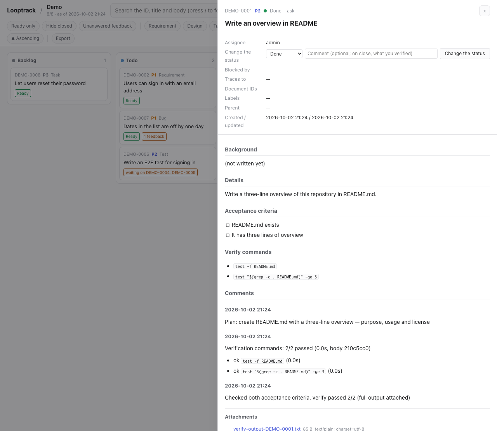
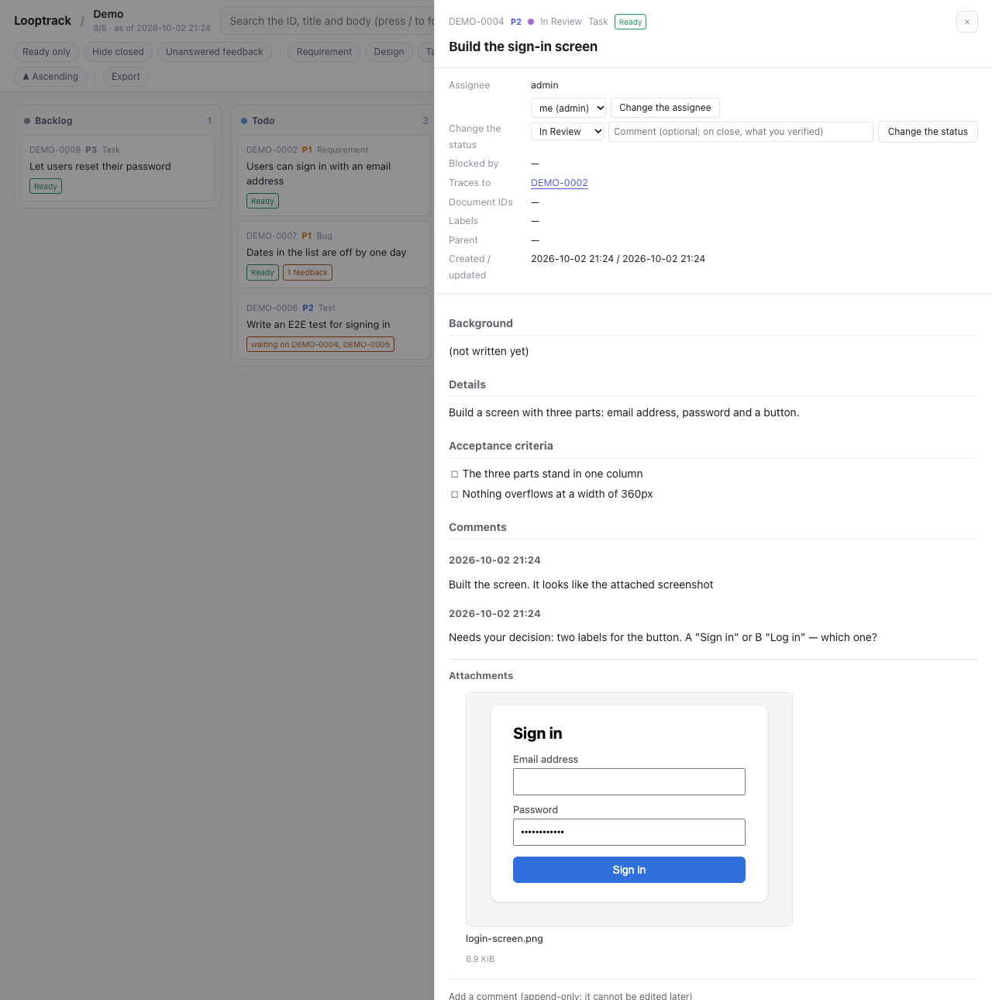
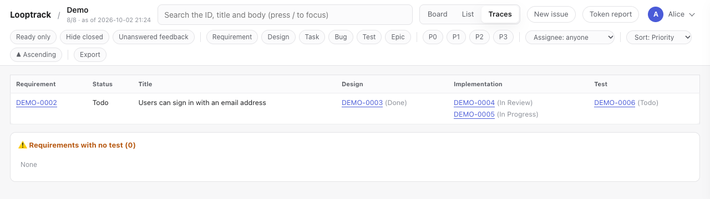

# Daily use

[Guide contents](README.md) · Previous: [Getting started with the server](server/getting-started.md) · [Getting started with the desktop app](desktop/getting-started.md) · Next: [Agent-specific notes](ai-agents.md)

This page uses CLI commands.
But the MCP tools do the same things (`create_issue`, `next`, `add_comment`, `set_status`, and so on), and the server applies the same checks either way.

## Your first loop

Once your agent is connected ([server](server/getting-started.md), [desktop app](desktop/getting-started.md)), both editions take the same path. Run one loop from start to finish.
The commands below run in a terminal where `LOOPTRACK_API_URL` and `LOOPTRACK_PROJECT` point at your server and project. Step 9 of [Getting started with the server](server/getting-started.md) sets them; for the desktop app, see [Use the CLI](desktop/using.md#use-the-cli). The examples use the project `demo`, whose ID prefix is `DEMO`.
Rather not use a terminal? Ask your agent to file the issue as well.

File your first issue and walk through one turn by hand.

```bash
looptrack issue new "Write an overview in README" --type task --body "$(cat <<'EOF'
Write a three-line overview of this repository in README.md.

## 受け入れ条件

- [ ] README.md exists
- [ ] It has three lines of overview

## 検証コマンド

- `test -f README.md`
- `test "$(grep -c . README.md)" -ge 3`
EOF
)"
looptrack issue next
```

`next` moves `DEMO-0001` to In Progress and shows its body and acceptance criteria.
`## 受け入れ条件` (acceptance criteria) and `## 検証コマンド` (verify commands) are the section headings the server looks for. You can write them in English instead: `## Acceptance criteria` and `## Verify commands` (case does not matter).
From here on, it's the agent's turn.
Open Claude Code and ask:

> Take the next issue and do one full loop. Verify the acceptance criteria before you close it.

The agent does the work, runs the verify commands with `verify`, records the results, and closes the issue.
Last, check the result yourself:

```bash
looptrack issue show DEMO-0001
looptrack issue verify DEMO-0001 --last
looptrack issue summary
```

If `show` lists the comments and the status is Done, your first loop is complete.
The same issue is in the browser too, on the project's page (`<server URL>/p/demo/`).
Select its card and the detail opens, with the comments, the verify result and the attachments in order.



PowerShell has no here-documents. Write the body to a file and pass it with `--body (Get-Content -Raw body.md)`.

## A typical day

1. When an agent session starts, a hook shows the agent the `summary` (all three loops)
2. If anything is waiting for you (②) or an outside reaction is unanswered (③), the agent raises it first. It records your answer as a comment
3. The agent picks up work with `next` and repeats work → verify → close
4. Anything that needs a decision collects In Review. Answer them in one batch, whenever it suits you
5. When you hear how people are using the product, tell the agent so it records the reaction on the issue

The board in the browser puts issues in a column per status. The In Review column holds what is waiting for you.


Want to check things yourself? These commands help:

```bash
looptrack issue summary                    # the three-part summary
looptrack issue list --status "In Review"  # waiting for a person
looptrack issue list --has-feedback        # issues with unanswered reactions
looptrack issue ready                      # ready to start
looptrack issue list --assignee me         # assigned to you
```

## How big an issue should be

- One issue = something one piece of work can close. That's the unit you can finish by checking every acceptance criterion.
- Rule of thumb: one session, one issue.
- Make a large goal an `epic` or `requirement` and list `task`s under it. By default `next` never picks an epic, and it won't pick a parent whose children are still open either.
- File bugs, separate problems, and open questions as soon as you find them. Don't let them live only in chat.
- Types are `requirement` / `design` / `task` / `bug` / `test` / `epic`. Priorities run from `P0` (right now) to `P3`.

```bash
looptrack issue new "Add a show/hide toggle to the password field" --type task --priority P2 \
  --labels "ui,login" --traces DEMO-0003 --body "$(cat <<'EOF'
Users often mistype their password, so let them see what they are typing.

## 受け入れ条件
- [ ] Clicking the eye icon shows the password in plain text
- [ ] Clicking it again masks it
- [ ] All existing end-to-end tests pass
EOF
)"
```

The `--body` text goes into the issue's description section. If it contains a `## 受け入れ条件` section, that becomes the acceptance criteria as written.
Passing a body through the shell? Wrap it in a quoted here-document (`<<'EOF'`).
Inside double quotes, the shell runs backticks and `$( )`, and that corrupts the text.

## Writing acceptance criteria

Acceptance criteria are what the agent checks, one by one, before marking an issue Done.
So write them in a form you can test. That's the whole point.

| Weak | Better |
| -- | -- |
| Make it faster | The list renders 1,000 rows within 500 ms |
| Make it easier to use | You can save in three clicks or fewer |
| Make it work properly | `make test` passes and there are at least two new tests |

- They go under the `## 受け入れ条件` heading in the body, as a checkbox list.
- Steer clear of vague words such as "fast" or "easy".
- Anything that needs human eyes is decided by a person through In Review.

## The verify-commands section

Give the body a `## 検証コマンド` section, and `verify` runs those commands on your machine and records the result on the issue.

```markdown
## 検証コマンド

- `make lint`
- `make test`
```

A fenced code block works too.

- One command per line. Line continuations (a trailing `\`) and here-documents aren't supported. Need several lines? Put them in a script and call that.
- Inside a code block, lines starting with `#` are skipped. Outside a code block, only list items that are entirely inline code are read.
- Limits: 20 commands, 1,000 characters per command.
- Commands run in order from the git root. A failure doesn't stop the rest.
- Each command gets up to 600 seconds, and the whole run 1,800 seconds (`--timeout`, `--total-timeout`).
- On Windows this needs Git Bash. Commands run under `bash -c`, and there's no fallback to `cmd.exe` or
  PowerShell, because a POSIX command line would mean something else there. Install Git for Windows
  (`winget install --id Git.Git -e`). `looptrack doctor` tells you whether it found a shell.

```bash
looptrack issue verify DEMO-0004 --list   # show the commands and the latest record without running
looptrack issue verify DEMO-0004          # run and record (0 all passed, 1 some failed, 2 no section)
looptrack issue verify DEMO-0004 --last   # show the latest record with output
```

Editing the body invalidates earlier records.
In a project with `verify.require_on_close`, you have to run `verify` again after editing before the issue can be marked Done.

The server finds the sections by their headings. Write them as `## Verify commands` and `## Acceptance criteria` (case doesn't matter), or in Japanese as `## 検証コマンド` and `## 受け入れ条件`.

## Attachments (evidence)

You can attach the evidence of a check to an issue as files.
That means the full test output, screenshots of the screens, generated reports and the like. The file itself stays on the server along with who attached it and when, so there's no need to settle for a path written in a comment.

```bash
looptrack issue attach DEMO-0004 screenshot.png report.html   # attach and print the attachment IDs
looptrack issue comment DEMO-0004 "Fixed the screen" --attach after.png
looptrack issue verify DEMO-0004 --attach-output              # put the full, untruncated output on the verify record
looptrack issue verify DEMO-0004 --attach coverage.html       # put other files on the record too (repeatable)
```

- An agent can't send a file through the MCP tools. It sends it with the CLI's `issue attach` and passes the IDs that come back in `attachments` of `report_verify` or `add_comment`. The guide and the MCP instructions tell the agent to do exactly that.
- In the browser, the comment box takes a file three ways: pick it, drag and drop it, or paste a screenshot. The drawer lists the attachments, and images show right there.
- If a text file holds something that looks like a secret (the shape of a token or a password), the CLI stops without sending any of the files. The server can't mask what's inside.
- Attachments can't be deleted. If you attached a secret by mistake, ask an administrator to purge the file ([Administration](server/admin.md#attachment-limits-and-purging)).
- By default the limits are 20MiB per file and 1GiB per project.

Here an agent has attached a screenshot of the screen it built and is asking for a decision In Review.



**Marking an issue Done needs evidence by default.**
On an issue whose body has verify commands, the server rejects Done unless the latest verify record for the current body carries an attachment. It rejects a missing record too.
Run `verify` with `--attach-output` or `--attach` and it goes through. An attachment added with `issue attach` alone isn't on the verify record, so it doesn't count.
To turn this off for a project, set the project rule `verify.require_evidence` to `false` ([Administration](server/admin.md#setting-project-rules)).

## Comment types

Comments are append-only. Nobody can edit or delete them.
What a comment means comes from its leading keyword.

| Starts with | Written by | When | Example |
| -- | -- | -- | -- |
| (nothing) | agent or person | as soon as a cause, decision, or plan is known | `Cause: the date conversion ignored the time zone. Fix: store in UTC` |
| `Decision:` (`判断:`) | the agent, recording a person's answer | the answer to an In Review item is an approval or instruction | `Decision: This wording is fine. Mark it Done` |
| `Changes requested:` (`差し戻し:`) | the agent, recording a person's answer | the answer asks for rework | `Changes requested: Put the button top right and match the existing colour` |
| `Feedback:` (`フィードバック:`) | the agent, recording what it was told | a participant or tester reacted | `Feedback: Tester A (18 Sep, while saving) could not find the save button` |

- Put the keyword at the very start, with no leading spaces or line breaks. Case doesn't matter for the English keywords. The Japanese keywords also accept a full-width colon (`：`).
- On `判断:`, move the issue to Done (`close --comment "判断: …"`). On `差し戻し:`, move it to Todo (`status <ID> Todo --comment "差し戻し: …"`).
- A `フィードバック:` comment counts as answered once a comment without a keyword, or a status change, follows it.
- Don't save it all up and write only the conclusion at the end. Write the cause when you find it, and the history survives even if the work stops half-way.

```bash
looptrack issue comment DEMO-0004 "Cause: the date conversion ignored the time zone. Fix: store in UTC"
looptrack issue status DEMO-0004 "In Review" --comment "Please decide: two wordings prepared, A or B?"
looptrack issue close DEMO-0004 --comment "判断: A approved. All three acceptance criteria checked"
looptrack issue status DEMO-0004 Todo --comment "差し戻し: Use B, and match the existing button colour"
```

## Assignees

Each issue has one assignee.
Why? So several people, or several agent sessions, don't end up working on the same issue at once.

- Moving an issue to In Progress makes you the assignee if nobody is assigned.
- An issue assigned to someone else can't be moved to In Progress or have its body edited (the server refuses). Ask them in a comment instead.
- To take it over, check with the assignee first, then add `--override "reason"`. The reason is recorded.
- `next` only picks issues assigned to you or to nobody.

```bash
looptrack issue assign DEMO-0004 me                          # assign to yourself (- to unassign)
looptrack issue assign DEMO-0004 alice --override "Taking over while Bob is on leave"
looptrack issue new "…" --assignee me                          # assign when filing
```

## Waiting on other issues (blocked_by)

When an issue has to wait for another to finish, put that other issue in `blocked_by`.
Until the blocker is Done or Canceled, the issue won't appear in `ready` or `next`.
Just writing "waiting" in a comment? That doesn't do it.

```bash
looptrack issue new "Build the checkout page" --type task --blocked-by DEMO-0010,DEMO-0011
```

## Requirements and traces

`traces` points to the requirement issue that this issue fulfils.
Give `design` / `task` / `test` / `bug` issues `--traces <requirement ID>`.

- Only IDs of issues that exist go in `traces`.
- IDs from documents such as specs (e.g. `FR-001`) go in `--refs`. `list --ref FR-001` looks them up in reverse.
- `matrix` prints the requirement → design → implementation → test table, plus warnings.

```bash
looptrack issue new "End-to-end test for the login page" --type test --traces DEMO-0003
looptrack issue matrix
```

The trace view in the browser shows the same table.



When every issue tracing a requirement is closed, the close response says so ("Every child of requirement <ID> is finished").
That's your cue. Check the requirement's acceptance criteria, and if they're met, close the requirement too.

## Editing an issue body

```bash
looptrack issue edit DEMO-0004    # writes a working copy to .claude/.looptrack-work/DEMO-0004.md
# edit the working copy
looptrack issue push DEMO-0004    # apply it (the working copy is removed)
```

If someone updated the issue in the meantime, `push` stops and shows the difference.
Merge that difference into your working copy, then apply it with `push --rebase`.

The body of a closed issue (Done / Canceled) can't be edited.
To reopen a topic, file a new issue and reference the old one in its body.

## Cleaning up worktrees

Work on one issue per git worktree, and merged worktrees and their branches pile up. Sooner or later
nobody can tell which ones are still alive. `looptrack worktree` collects the facts you need to decide.

```bash
looptrack worktree list          # every worktree: merged?, uncommitted changes?, locked?, when it last moved
looptrack worktree prune         # show what would go. Nothing is deleted
looptrack worktree prune --yes   # actually delete
looptrack worktree mark          # record that this session is using this worktree
looptrack worktree mark --yes    # overwrite it even when another session's marker is there
```

A worktree is removed only if **all** of these hold: it isn't the main worktree, it's merged into
the default branch, it has no uncommitted changes, it isn't locked, its branch isn't published to a
remote, and it hasn't moved for at least `--min-age` (30 minutes by default, since another session may
still be inside it). Anything else is kept, with the reason printed next to it.

Tracking branches are a bit different. A worktree whose branch tracks a remote branch that still exists
is treated as a permanent one (the kind you deploy or cut over from) and is never cleaned up. Once the
upstream is gone, it's an ordinary temporary branch again. Build leftovers (`node_modules`, `.DS_Store`,
interpreter caches and friends) don't count as uncommitted changes. A worktree with uncommitted changes
older than a day is reported as "about to be lost", so you move the work somewhere safe
instead of forgetting it. Branches left behind by a removed worktree are listed too.

`mark` never overwrites another session's marker. If one is already there, it fails with exit
code 1 and prints `Another session's marker exists (<session>, <time>). Not overwriting (pass --yes
to overwrite).` Read that as "somebody else is inside this worktree". Ask them first, and only then
take it over with `looptrack worktree mark --yes`. A marker that can't be read or parsed gets
the same treatment (`Could not read the existing marker ...`), because there's no telling whose it is.
Marking again with your own session isn't a failure, though. Neither is the main worktree: it prints
`This is the main worktree, so no marker is written (several sessions use it at the same time).` and
exits 0.

With the loop layer installed, a session-start hook tells you when there's something to clean up or
something about to be lost, and says nothing otherwise. It never deletes anything.
Don't want the notice? Set `LOOPTRACK_LOOP_WORKTREE_NOTICE=0`.

## Things not to do

- Starting work without an issue
- Marking an issue Done without checking the acceptance criteria
- Getting around a rule rejection by another path (MCP or edit)
- Writing access tokens into chat, commits, issues, or logs
- Pasting production data into issues (mask it or write only IDs)

## Language (English / Japanese)

Everything you read comes out in English or Japanese. Set it explicitly with
`LOOPTRACK_LANG`, or just leave it to your terminal and browser:

```bash
LOOPTRACK_LANG=en looptrack issue list   # this command only
export LOOPTRACK_LANG=ja                 # this shell
```

| Order | Command line | Web pages and MCP |
| -- | -- | -- |
| 1 | `LOOPTRACK_LANG` | `?lang=ja` / `?lang=en`, for that one request |
| 2 | `LC_ALL`, then `LC_MESSAGES`, then `LANG` | `LOOPTRACK_LANG`, which the CLI sends as an explicit choice |
| 3 | English | The display language you pick on `/account` (it can be left unset) |
| 4 | — | `Accept-Language` |
| 5 | — | English |

Pick a display language on `/account`, and even a connection that can't send headers (MCP) comes back in it.
Set it back to unset and it follows your browser and terminal again, exactly as before.

The same goes for what an AI agent reads. The MCP `instructions`, the `guide` bodies and the tool
descriptions come back in the same language, picked for each connection. The rules installed into
your project ship in both languages, and the hooks pick one at run time by the
same order. Skills are the exception. `looptrack issue init` installs only the one in the language
of the installation, so run it again after changing the language.
