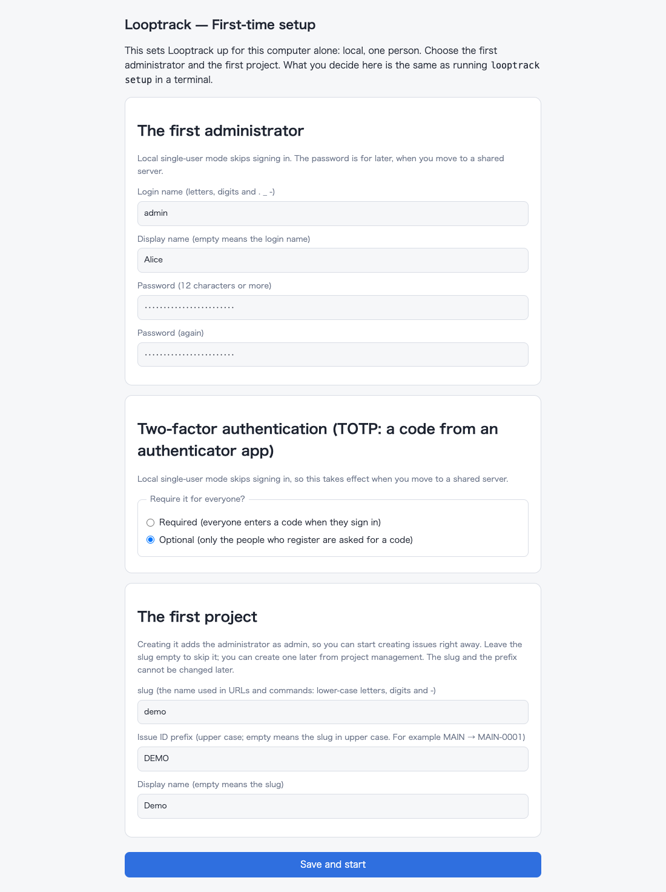
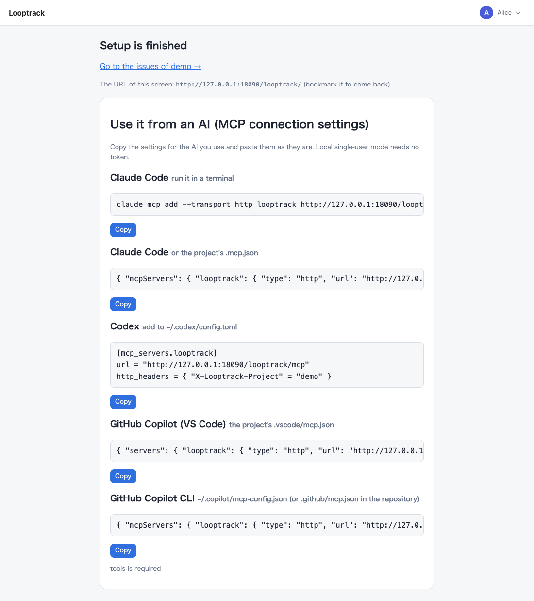

# Getting started with the desktop app

[Guide contents](../README.md) · [Desktop app](README.md) · Next: [Your first loop](../daily-use.md#your-first-loop) · Related: [Using the desktop app](using.md)

This page takes you from downloading the desktop app to connecting your AI agent to it.
You never open a terminal on the way. For a server shared by several people, use the [server edition](../server/README.md) instead.

## Download

From the releases page (https://github.com/howashoji/looptrack/releases ), download the file for your OS and `SHA256SUMS`.

| OS | File | What is inside |
| -- | -- | -- |
| macOS 13 or later (Apple silicon and Intel) | `Looptrack_<version>_macos_universal.dmg` | `Looptrack.app` |
| Windows 10 / 11 | `Looptrack_<version>_windows_amd64_setup.exe` (`arm64` for Arm PCs) | The installer (recommended) |
| Windows 10 / 11, without installing | `Looptrack_<version>_windows_amd64.zip` (`arm64` for Arm PCs) | `Looptrack\Looptrack.exe` (the app) and `Looptrack\cli\looptrack.exe` (the CLI) |
| Linux (x86_64 / aarch64) | `Looptrack_<version>_linux_x86_64.AppImage` (`aarch64` for Arm) | The app as a single file |

Then check the download against `SHA256SUMS` (`shasum -a 256 -c SHA256SUMS --ignore-missing` on macOS, `sha256sum -c SHA256SUMS --ignore-missing` on Linux, `Get-FileHash` on Windows).

## First launch

### macOS

Open the dmg and drag `Looptrack` onto `Applications`, then double-click `Looptrack` in `Applications`.
It's signed and notarized, so macOS won't warn you.
There's no Dock icon. Look for the loop icon in the menu bar.

### Windows

Double-click `Looptrack_<version>_windows_amd64_setup.exe`.
The installer isn't code-signed yet, so SmartScreen may say "Windows protected your PC". If it does, choose "More info" → "Run anyway".
No administrator rights needed. It installs into `%LOCALAPPDATA%\Programs\Looptrack Desktop` for you only, and adds Looptrack to the Start menu.
You'll be offered two options. Both can be changed later from the tray menu:

- Start Looptrack when you log in
- Make the looptrack CLI available (see [Use the CLI](using.md#use-the-cli))

When the installer finishes, leave "Launch Looptrack" checked, or start Looptrack from the Start menu.
The icon shows up in the notification area. But Windows 11 tucks new icons under the "^" (hidden icons) button.
Click "^" and drag the Looptrack icon onto the taskbar to keep it visible. You can also turn it on in Settings → Personalization → Taskbar → Other system tray icons.
Left-click the icon for the menu.

Rather not install anything? Use the zip. Extract it to a folder in your user profile (for example `%USERPROFILE%\Apps`, which gives `%USERPROFILE%\Apps\Looptrack\Looptrack.exe`) and double-click `Looptrack.exe`.
Just don't extract it into `%LOCALAPPDATA%\Programs\looptrack`. That folder is where the CLI goes.

### Linux

Put the AppImage somewhere it'll stay (for example `~/Applications`), make it executable, and double-click it. Running it from a terminal works too.
It doesn't need FUSE 2. It does need `fusermount3`, which a normal desktop install already has (on Ubuntu: `sudo apt install fuse3`).
If you can't install it, start the app with `APPIMAGE_EXTRACT_AND_RUN=1 ./Looptrack_<version>_linux_x86_64.AppImage`. Or unpack it with `./Looptrack_<version>_linux_x86_64.AppImage --appimage-extract` and run `squashfs-root/usr/bin/looptrack`.
The tray icon needs a desktop that shows StatusNotifierItem icons (KDE, Xfce, Cinnamon, …). On GNOME, install the "AppIndicator and KStatusNotifierItem Support" extension.
The app still runs without a tray. Stop it with `looptrack desktop --quit` (see [Troubleshooting](troubleshooting.md)).
On the first start, the app adds Looptrack to the app list (the launcher and the activities search). It puts `~/.local/share/applications/looptrack.desktop` and an icon (`~/.local/share/icons/hicolor/256x256/apps/looptrack.png`) in place, so you can start it from there afterwards.
Moved the AppImage? The entry follows the new location the next time you start that AppImage. If you don't want the entry, clear "Show in the app list" in the tray (it then stays off on later starts too).

Double-clicking again while the app is running won't start a second copy. It just opens the UI in the browser.

## Get started without the CLI

Finishing setup and connecting an AI agent both happen through the app's own screens and a chat with your agent.
You never need to open a terminal or type a `looptrack` command yourself.

### Finish setup in the browser

The first time, the browser shows a one-time setup form instead of the normal screen. It's the same whether you got there by double-clicking the app, choosing "Open the app" in the tray, or opening the URL `looptrack desktop --status` prints.

| Section | What to enter |
| -- | -- |
| Administrator | Login (letters, digits, `.` `_` `-`), display name (optional), a password (12+ characters, entered twice) |
| Two-factor auth | Required or optional. Local mode skips sign-in either way, so this only matters if you later point other people at this same server |
| First project | Slug, ID prefix, and name — all optional. Leave them blank and create one later, from `/admin/projects` or by asking your agent |

Submit the form. The next page shows a link to your project (if you created one) and the MCP connection settings for Claude Code, Codex and GitHub Copilot. Those are the same settings "Copy AI connection settings" puts on your clipboard.

The form appears only while no administrator exists yet. Once you've finished it, the app goes straight to the normal screen from then on.
You can still open the connection settings any time, from the tray's "Open the connection settings page".

### Connect your AI agent by chat

1. Open your agent (Claude Code, Codex, GitHub Copilot, …) in the repository you want to track issues for.
2. From the tray menu, choose "Copy AI connection settings". You can also choose "Open the connection settings page" and copy the same thing from the browser.
3. Paste it into a prompt along with what you want. For example, write "Add this MCP connection, then set up issue management for this repository" and paste the copied block below that sentence.
4. Approve what the agent proposes as it goes: adding the MCP connection, then the install command it gets back from the `setup` tool. [Agent-specific notes](../ai-agents.md) walks through exactly what happens at each step, under "Installing through MCP only". You won't type any of it yourself. (Signing in only comes up if you point the connection at a server other people share, not at this local app.)
5. Restart the agent when it asks you to, and approve its hooks.

From here on, it's all prompts.
Start by asking the agent to file an issue, or to take the next one and run a full loop.
That part is the same in the server edition, and [Your first loop](../daily-use.md#your-first-loop) walks you through it.
