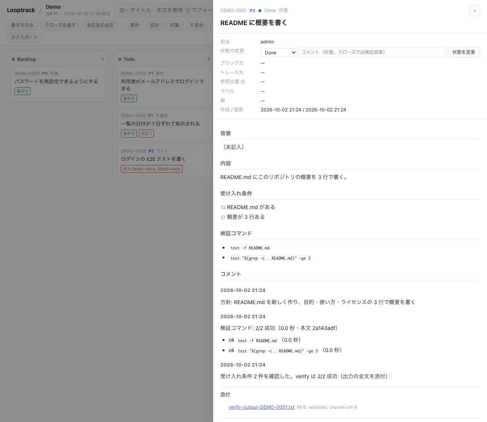
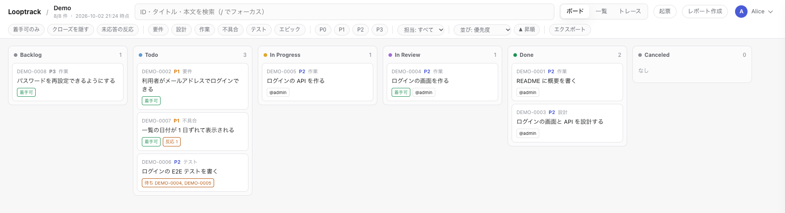
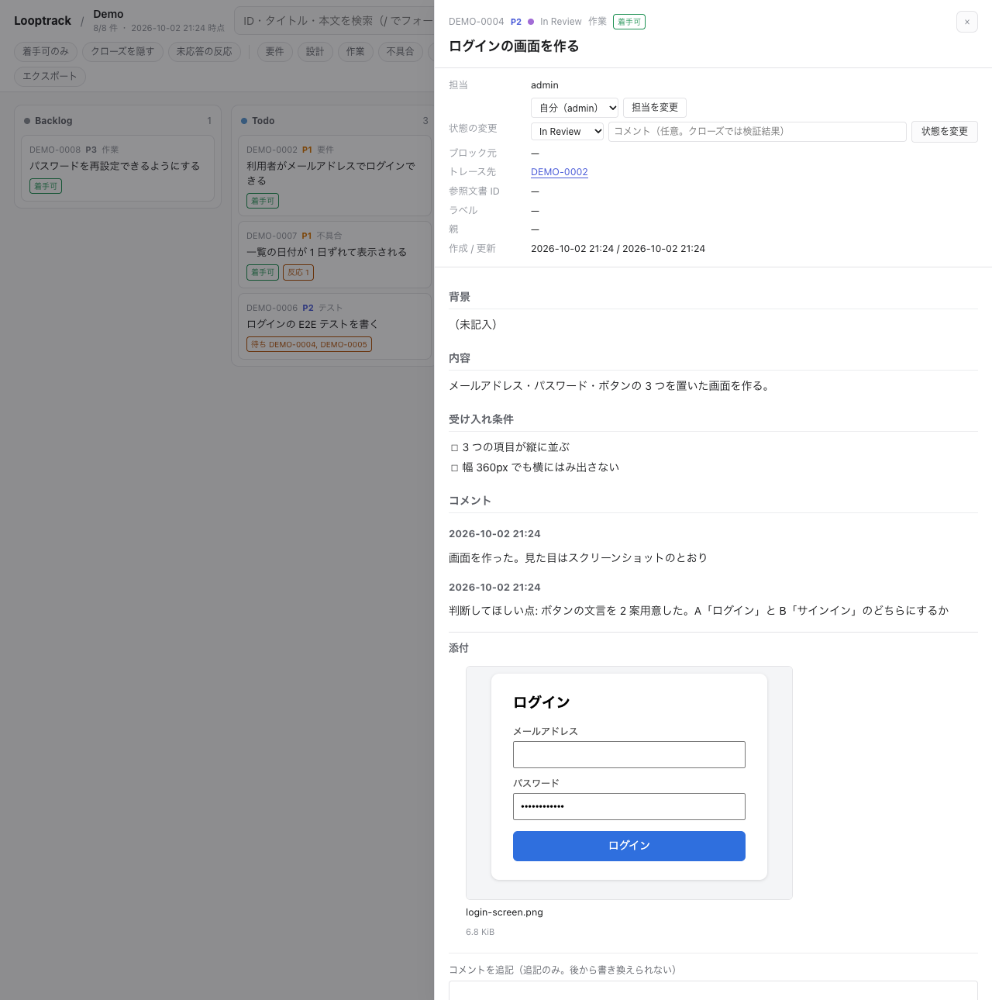
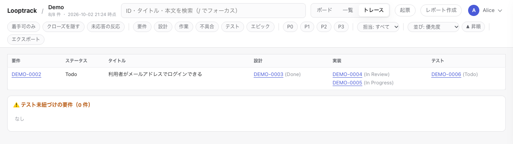

# 日々の使い方

[ガイドの目次](README.md) · 前: [サーバ版の始め方](server/getting-started.md) · [デスクトップ版の始め方](desktop/getting-started.md) · 次: [AI ごとの手引き](ai-agents.md)

説明には CLI のコマンドを使います。
とはいえ、`create_issue`・`next`・`add_comment`・`set_status` といった MCP のツールでも同じことができます。どちらから操作してもサーバが検査する規則は同じです。

## 最初の 1 周

AI とつないだ後はサーバ版もデスクトップ版も同じ道をたどります。つなぐまでの手順は[サーバ版](server/getting-started.md)と[デスクトップ版](desktop/getting-started.md)の始め方にあります。まずは 1 周を最初から最後まで回してみましょう。
下のコマンドは `LOOPTRACK_API_URL` と `LOOPTRACK_PROJECT` が自分のサーバとプロジェクトを指すターミナルで実行します。サーバ版なら[始め方](server/getting-started.md)の手順 9 で設定済みです。デスクトップ版は [CLI を使う](desktop/using.md#cli-を使う)を見てください。例のプロジェクトは `demo` で、ID の接頭辞は `DEMO` です。
ターミナルを使いたくない？ 起票も AI に頼めます。

最初のイシューを起票して 1 周を手で回してみましょう。

```bash
looptrack issue new "README に概要を書く" --type task --body "$(cat <<'EOF'
README.md にこのリポジトリの概要を 3 行で書く。

## 受け入れ条件

- [ ] README.md がある
- [ ] 概要が 3 行ある

## 検証コマンド

- `test -f README.md`
- `test "$(grep -c . README.md)" -ge 3`
EOF
)"
looptrack issue next
```

`next` が `DEMO-0001` を In Progress にして本文と受け入れ条件を表示します。
ここから先は AI の出番です。
Claude Code を開いてこう頼みます。

> イシューの next から 1 周回して。受け入れ条件を検証してから close して。

AI は作業を進めてから `verify` で検証コマンドを実行して結果を残し、`close` します。
最後に手元でも結果を確かめておきましょう。

```bash
looptrack issue show DEMO-0001
looptrack issue verify DEMO-0001 --last
looptrack issue summary
```

`show` にコメントと Done の状態が出ていれば最初の 1 周は完了です。
同じイシューはブラウザのプロジェクトの画面（`<サーバの URL>/p/demo/`）でも見られます。
カードを選ぶと詳細が開き、コメント・検証の結果・添付が順に並びます。



PowerShell ではヒアドキュメントが使えません。本文をファイルに書いてから `--body (Get-Content -Raw body.md)` で渡してください。

## 1 日の流れ

1. AI のセッションを始めると、hook が `summary`（3 層の要約）を AI に見せます。
2. ② 人の判断待ちや ③ 未応答の反応があれば、AI のほうから相談してきます。答えると AI がコメントに残します。
3. AI が `next` で着手して作業・検証・close を繰り返します。
4. 判断が要るものは In Review にたまります。都合のよいときにまとめて答えてください。
5. 使った人の反応を聞いたら、AI に伝えてイシューに残してもらいましょう。

ブラウザのボードでは状態ごとの列にイシューが並びます。判断を待っているのは In Review の列です。



自分の目で確かめたいときは？　次のコマンドが便利です。

```bash
looptrack issue summary                    # 3 層の要約
looptrack issue list --status "In Review"  # 人の判断待ち
looptrack issue list --has-feedback        # 未応答の反応があるもの
looptrack issue ready                      # 着手可能なもの
looptrack issue list --assignee me         # 自分が担当のもの
```

## 起票の粒度

- 1 つのイシューは 1 回の作業で閉じられる大きさに。受け入れ条件を全部確かめて Done にできる、そんな単位です。
- 目安は 1 つのセッションで 1 つのイシュー。
- 大きな目標は `epic` か `requirement` にしてその下に `task` を並べます。`next` は既定で epic を取りませんし、子が残っている親のイシューも取りません。
- 不具合・別の課題・決まっていない事項は、見つけた時点で起票してください。会話だけで済ませないでください。
- 型は `requirement` / `design` / `task` / `bug` / `test` / `epic`。優先度は `P0`（すぐ）〜 `P3` で付けます。

```bash
looptrack issue new "ログイン画面にパスワードの表示切替を付ける" --type task --priority P2 \
  --labels "ui,login" --traces DEMO-0003 --body "$(cat <<'EOF'
パスワードの打ち間違いが多いので、入力中の文字を確かめられるようにする。

## 受け入れ条件
- [ ] 目のアイコンを押すと、パスワードが平文で見える
- [ ] もう一度押すと、伏せ字に戻る
- [ ] 既存の e2e テストがすべて通る
EOF
)"
```

`--body` の本文は「内容」の節に入ります。本文に `## 受け入れ条件` の節を書けばそれがそのまま受け入れ条件です。
シェルで本文を渡すなら引用符付きのヒアドキュメント（`<<'EOF'`）で囲んでください。
二重引用符だと中のバッククォートや `$( )` が実行されて本文が壊れます。

## 受け入れ条件の書き方

受け入れ条件は AI が Done にする前に 1 つずつ確かめる項目です。
だから、テストできる形で書くのが肝心です。

| 良くない例 | 良い例 |
| -- | -- |
| 速くする | 一覧の表示が 1,000 件で 500 ミリ秒以内 |
| 使いやすくする | 3 回以内のクリックで保存できる |
| ちゃんと動く | `make test` が通り、新しいテストが 2 件以上ある |

- 書く場所は本文の `## 受け入れ条件` の節。チェックボックスの箇条書きにします。
- 「速い」「使いやすい」のようなあいまいな語は避けてください。
- 人の目で確かめる項目は In Review で人が判断します。

## 検証コマンド節

本文に `## 検証コマンド` の節を書いておくと、`verify` がそのコマンドを手元で実行して結果をイシューに記録してくれます。

```markdown
## 検証コマンド

- `make lint`
- `make test`
```

コードブロックでも書けます。

- 1 行に 1 コマンド。行の継続（末尾の `\`）とヒアドキュメントは使えません。複数行が要るならスクリプトにしてそれを呼んでください。
- コードブロックの中では `#` で始まる行を読み飛ばします。コードブロックの外で読むのは、行全体がインラインコードになっている箇条書きだけです。
- 上限は 20 コマンド。1 コマンドは 1,000 文字までです。
- コマンドは git のルートで順に実行します。途中で失敗しても最後まで実行します。
- 時間の上限は 1 コマンド 600 秒・全体 1,800 秒（`--timeout`・`--total-timeout`）。
- Windows では Git Bash が要ります。コマンドは `bash -c` で実行し、`cmd.exe` や PowerShell で代わりに実行することはありません。
  POSIX の書き方のコマンドがそちらでは別の意味になってしまうからです。Git for Windows（`winget install --id Git.Git -e`）を
  入れてください。見つかるかどうかは `looptrack doctor` で確かめられます。

```bash
looptrack issue verify DEMO-0004 --list   # 実行せずに一覧と直近の記録を見る
looptrack issue verify DEMO-0004          # 実行して記録する（全成功 0・失敗あり 1・節なし 2）
looptrack issue verify DEMO-0004 --last   # 直近の記録を出力つきで見る
```

本文を直すとそれまでの記録は無効になります。
`verify.require_on_close` のプロジェクトでは直した後に `verify` をもう一度実行しないと Done にできません。

サーバは節を見出しの語で探します。見出しは `## 検証コマンド`・`## 受け入れ条件` のほか、英語の `## Verify commands`・`## Acceptance criteria` でも書けます（英語の見出しは大文字小文字を区別しません）。
コメントの先頭の語も英語で書けます。`Decision:`（判断:）・`Changes requested:`（差し戻し:）・`Feedback:`（フィードバック:）です。

## 添付（エビデンス）

検証の証跡はファイルのままイシューに添付できます。
テストの出力の全文・画面のスクリーンショット・生成したレポートといったものです。本体はサーバに残って誰がいつ付けたかも記録されます。だからコメントにパスを書いて済ませる必要はありません。

```bash
looptrack issue attach DEMO-0004 screenshot.png report.html   # 添付して、添付の ID を出す
looptrack issue comment DEMO-0004 "画面を直した" --attach after.png
looptrack issue verify DEMO-0004 --attach-output              # 切る前の出力の全文を verify の記録に付ける
looptrack issue verify DEMO-0004 --attach coverage.html       # ほかのファイルも記録に付ける（繰り返せる）
```

- AI は MCP のツールではファイルを送れません。CLI の `issue attach` で送って返った ID を `report_verify` か `add_comment` の `attachments` に渡します。guide と MCP の案内文が AI にこの手順を指示します。
- ブラウザではコメントの欄でファイルを選ぶ・ドラッグ&ドロップする・スクリーンショットを貼り付けるの 3 通りで添付できます。ドロワーに添付の一覧が出て画像はその場で見られます。
- テキストのファイルに秘密らしいもの（トークンやパスワードの形）があると、CLI は 1 件も送らずに止まります。サーバでは中身を隠せないからです。
- 添付は消せません。秘密を誤って添付したときは管理者に本体の消去を頼んでください（[管理者の手引き](server/admin.md#添付の上限と消去)）。
- 上限の既定は 1 ファイル 20MiB、1 プロジェクト 1GiB です。

下の例は作った画面のスクリーンショットを添付し、In Review で判断を仰いでいるところです。



**Done にするには既定でエビデンスが要ります。**
本文に検証コマンドがあるイシューは、いまの本文に対する最新の verify の記録に添付が無いとサーバが Done を拒否します。記録そのものが無いときも同じです。
`verify` に `--attach-output` か `--attach` を付けて実行すれば通ります。`issue attach` だけで付けた添付は verify の記録に付かないので、この条件を満たしません。
プロジェクトでこの網を切るにはプロジェクト別ルールの `verify.require_evidence` を `false` にします（[管理者の手引き](server/admin.md#プロジェクト別ルールの設定)）。

## コメントの型

コメントは追記だけで書き換えも削除もできません。
意味は先頭の語で分けます。

| 先頭 | 誰が書くか | いつ | 例 |
| -- | -- | -- | -- |
| （なし） | AI・人 | 原因・判断・方針が分かった時点 | `原因: 日付の変換で時差を見ていなかった。対応: UTC で保存する` |
| `判断:` | 人の返答を AI が残す | In Review への返答が了承・指示のとき | `判断: この文言で良い。Done にする` |
| `差し戻し:` | 人の返答を AI が残す | In Review への返答がやり直しのとき | `差し戻し: ボタンは右上に。色は既存に合わせる` |
| `フィードバック:` | 聞いた反応を AI が残す | 参加者・テスターの反応を聞いたとき | `フィードバック: テスター A（9/18・保存の操作で）保存ボタンが見つからない` |

- 先頭の語の前には空白も改行も置きません。全角のコロン（`：`）でも同じに扱います。
- `判断:` なら Done（`close --comment "判断: …"`）へ動かします。`差し戻し:` のときの行き先は Todo（`status <ID> Todo --comment "差し戻し: …"`）です。
- `フィードバック:` の後に、先頭の語の無いコメントか状態の変更が付けば「応答済み」です。
- 結論だけを後からまとめて書くのはやめておきましょう。原因が分かった時点で書いておけば、途中で止まっても経緯が残ります。

```bash
looptrack issue comment DEMO-0004 "原因: 日付の変換で時差を見ていなかった。対応: UTC で保存する"
looptrack issue status DEMO-0004 "In Review" --comment "判断してほしい点: 文言を 2 案用意した。A と B のどちらにするか"
looptrack issue close DEMO-0004 --comment "判断: A 案で了承。受け入れ条件 3 件を確認済み"
looptrack issue status DEMO-0004 Todo --comment "差し戻し: B 案にする。ボタンの色も既存に合わせる"
```

## 担当者

イシューには担当者が 1 人付きます。
複数の人や AI のセッションが同じイシューを同時に進めてしまわないためです。

- In Progress にしたとき、担当が未設定なら自分が担当になります。
- 他の人が担当しているイシューは In Progress にできないし本文も直せません。サーバが拒否するのでコメントで依頼してください。
- 引き継ぐなら担当者に確かめてから `--override "理由"` を付けます。理由は記録に残ります。
- `next` が取るのは自分が担当のイシューと担当が未設定のイシューだけ。

```bash
looptrack issue assign DEMO-0004 me                          # 自分を担当にする（- で外す）
looptrack issue assign DEMO-0004 alice --override "休暇中のため引き継ぐ"
looptrack issue new "…" --assignee me                          # 起票と同時に担当を決める
```

## 待ち（blocked_by）

別のイシューの完了を待つイシューはその相手を `blocked_by` に入れます。
待ち先が Done か Canceled になるまで `ready` にも `next` にも出てきません。
コメントに「待ち」と書くだけでは効きません。

```bash
looptrack issue new "決済の画面を作る" --type task --blocked-by DEMO-0010,DEMO-0011
```

## 要件と traces

`traces` はそのイシューが満たす要件のイシューを指します。
`design` / `task` / `test` / `bug` には `--traces <要件の ID>` を付けます。

- `traces` に入れられるのは実在するイシューの ID だけ。
- 仕様書などの文書の ID（例 `FR-001`）は `--refs` に入れます。`list --ref FR-001` で逆に引けます。
- `matrix` は要件 → 設計 → 実装 → テストの対応表と警告を出します。

```bash
looptrack issue new "ログイン画面の e2e テスト" --type test --traces DEMO-0003
looptrack issue matrix
```

ブラウザのトレースでも同じ対応表を見られます。



ある要件を traces で指すイシューがすべて閉じると、close の応答に「要件 <ID> の下位がすべて完了しました」と出ます。
出たら要件の受け入れ条件を確かめる番です。満たしていれば要件も close します。

## 本文を直す

```bash
looptrack issue edit DEMO-0004    # 作業コピー .claude/.looptrack-work/DEMO-0004.md を作る
# 作業コピーをエディタで直す
looptrack issue push DEMO-0004    # 反映する（作業コピーは消える）
```

誰かが先に更新していたら `push` は差分を出して止まります。
その差分を取り込んでから `push --rebase` で反映してください。

閉じたイシュー（Done / Canceled）の本文は直せません。
同じ話をもう一度扱うなら新しく起票して、本文で元のイシューを参照します。

## 作業ツリーの後始末

1 つの課題ごとに worktree を作って進めていると、取り込み済みの作業ツリーとブランチがたまっていきます。やがてどれが使われているのか分からなくなります。
片付けの判断に要る材料は `looptrack worktree` が集めてくれます。

```bash
looptrack worktree list          # 取り込み済みか・未コミットがあるか・locked か・最後に動いたのはいつか
looptrack worktree prune         # 消す対象を示すだけ（何も消しません）
looptrack worktree prune --yes   # 実際に消す
looptrack worktree mark          # いまのセッションがこの作業ツリーを使っていることを記録する
looptrack worktree mark --yes    # 別のセッションの印があっても上書きする
```

消えるのは次の条件を**すべて**満たすものだけです。それ以外は理由を付けて残します。

- 本体の作業ツリーではない
- 既定のブランチに取り込み済み
- 未コミットの変更が無い
- locked ではない
- リモートに公開されているブランチではない
- `--min-age`（既定 30 分）以上動いていない。ほかのセッションが使っている最中かもしれないからです

リモートを追うブランチの作業ツリーは少し扱いが違います。追い先がまだあれば、配置や切り替えに使う常設のものとみなして片付けません。追い先が消えたらふつうの一時のブランチとして扱います。
`node_modules`・`.DS_Store`・処理系のキャッシュといった生成物は未コミットの変更に数えません。
1 日以上前の未コミットの変更がある作業ツリーには、「中身が失われかけています」と表示されます。忘れる前に退避しておきましょう。
作業ツリーを消した後に残るブランチも一覧に出ます。

`mark` は別のセッションの印を上書きしません。既に印があれば終了コード 1 で失敗します。
「別のセッション <セッション>（<時刻>）の印があります。上書きしません（--yes で上書き）。」と出たら、
その作業ツリーは誰かが使っている最中だと考えてください。引き取るなら相手に一声かけてから
`looptrack worktree mark --yes` で上書きしてください。印が読めないときや壊れているときも、誰のものか分からないので
同じ扱いになります。このときは「既存の印（…）を読めません（…）。上書きしません（--yes で上書き）。」と出ます。
一方、自分のセッションの印を付け直しても失敗にはなりません。本体の作業ツリーでも失敗にはならず、
「本体の作業ツリーなので印を付けません（複数のセッションが同時に使うため）。」と出て終了コードは 0 です。

loop を入れていれば片付けられるものや失われかけているものがあるときだけ、セッションの冒頭に hook が知らせます。
この hook は何も消しません。
知らせが要らないなら `LOOPTRACK_LOOP_WORKTREE_NOTICE=0` を設定してください。

## やってはいけないこと

- イシューを立てずに作業を始める
- 受け入れ条件を確かめずに Done にする
- ルールで拒否された操作を MCP や edit といった別の経路で回避する
- アクセストークンを会話・コミット・イシュー・ログに書く
- 本番のデータをそのままイシューに貼る（マスクするか ID だけを書く）

## 表示の言語（日本語 / 英語）

文面は日本語か英語で表示されます。`LOOPTRACK_LANG` で指定してもいいし、端末とブラウザの設定に任せても構いません。

```bash
LOOPTRACK_LANG=en looptrack issue list   # このコマンドだけ
export LOOPTRACK_LANG=ja                 # このシェルの間
```

| 順 | コマンドライン | 画面・MCP |
| -- | -- | -- |
| 1 | `LOOPTRACK_LANG` | URL の `?lang=ja` / `?lang=en`（その要求だけ） |
| 2 | `LC_ALL` → `LC_MESSAGES` → `LANG` | `LOOPTRACK_LANG`（CLI が明示の指定として送る） |
| 3 | 英語 | `/account` で選ぶ「表示の言語」（設定なしにもできる） |
| 4 | — | `Accept-Language` |
| 5 | — | 英語 |

`/account` の「表示の言語」を選んでおけば、ヘッダを送れない MCP の接続でもその言語で返ってきます。
「設定なし」に戻すと、これまでどおりブラウザや端末の設定に従います。

AI が読む文も同じです。MCP の `instructions`・`guide` の本文・ツールの説明は、接続ごとに同じ順で言語が決まります。
プロジェクトに配る rules は日英の両方を置き、hook が実行時に上と同じ順で選びます。
skill だけは違います。`looptrack issue init` が導入時の言語の 1 本だけを置くので、言語を変えたら `looptrack issue init` をもう一度実行してください。
