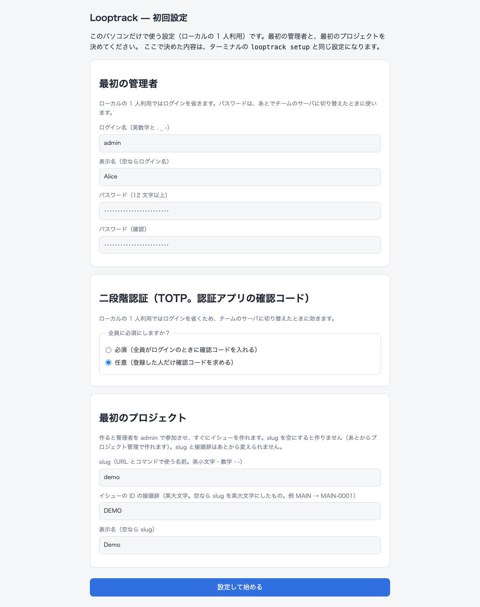
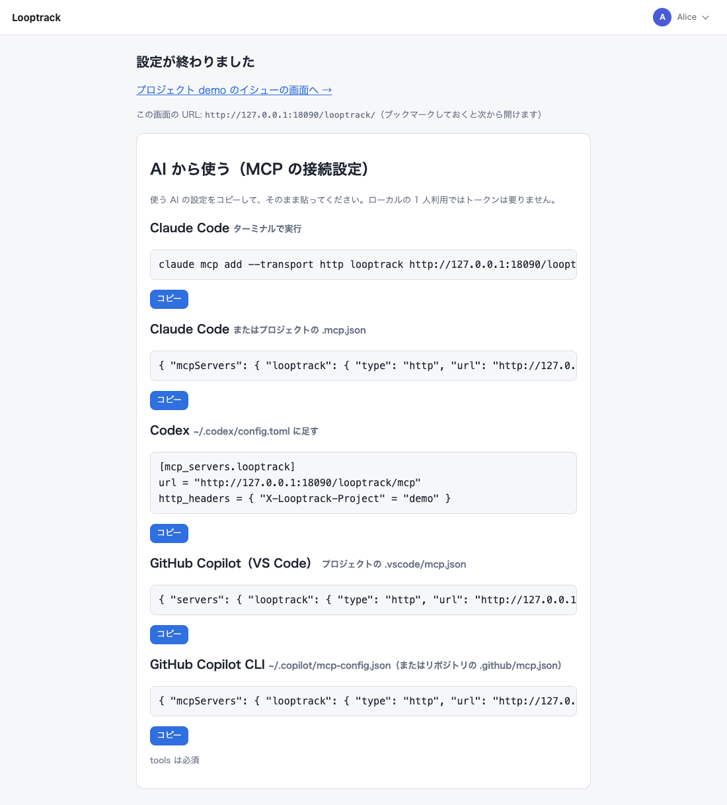

# デスクトップ版の始め方

[ガイドの目次](../README.md) · [デスクトップ版](README.md) · 次: [最初の 1 周](../daily-use.md#最初の-1-周) · 関連: [デスクトップ版の使い方](using.md)

デスクトップ版のアプリを取得してから、AI エージェントをつなぐまでの手順です。
途中でターミナルを開く場面はありません。複数人で共有するサーバなら[サーバ版](../server/README.md)を使ってください。

## 取得

リリースのページ（https://github.com/howashoji/looptrack/releases ）から、OS に合うファイルと `SHA256SUMS` を落としてください。

| OS | ファイル | 中身 |
| -- | -- | -- |
| macOS 13 以降（Apple シリコン・Intel） | `Looptrack_<版>_macos_universal.dmg` | `Looptrack.app` |
| Windows 10 / 11 | `Looptrack_<版>_windows_amd64_setup.exe`（Arm の PC は `arm64`） | インストーラ（こちらがおすすめ） |
| Windows 10 / 11・入れずに使う | `Looptrack_<版>_windows_amd64.zip`（Arm の PC は `arm64`） | `Looptrack\Looptrack.exe`（アプリ）と `Looptrack\cli\looptrack.exe`（CLI） |
| Linux（x86_64 / aarch64） | `Looptrack_<版>_linux_x86_64.AppImage`（Arm は `aarch64`） | アプリ（ファイル 1 つ） |

取得したら `SHA256SUMS` と照らし合わせておきましょう。使うコマンドは OS ごとに次のとおりです。

- macOS: `shasum -a 256 -c SHA256SUMS --ignore-missing`
- Linux: `sha256sum -c SHA256SUMS --ignore-missing`
- Windows: `Get-FileHash`

## 最初の起動

### macOS

dmg を開いて `Looptrack` を `アプリケーション` へドラッグし、`アプリケーション` の `Looptrack` をダブルクリックします。
署名と公証をしてあるので macOS の警告は出ません。
Dock にアイコンは出ません。探すのはメニューバーの輪のアイコンです。

### Windows

`Looptrack_<版>_windows_amd64_setup.exe` をダブルクリックします。
インストーラにはまだコード署名がありません。そのため SmartScreen が「Windows によって PC が保護されました」と出すことがあります。そのときは「詳細情報」→「実行」を選んでください。
管理者権限は要りません。自分だけの場所（`%LOCALAPPDATA%\Programs\Looptrack Desktop`）に入り、スタートメニューに Looptrack が登録されます。
途中で選択肢が 2 つ出ます。どちらも後からトレイのメニューで変えられます。

- ログイン時に起動する
- CLI を使えるようにする（[CLI を使う](using.md#cli-を使う)）

最後の「Looptrack を起動する」にチェックを入れたまま終えるか、スタートメニューから起動します。
アイコンが出るのは通知領域です。ところが Windows 11 は新しいアイコンを時計の横の「^」（隠れているインジケーター）の中に入れてしまいます。
「^」を押して Looptrack のアイコンをタスクバーへドラッグすれば、いつも見えるようになります。「設定 → 個人用設定 → タスクバー → その他のシステム トレイ アイコン」でも切り替えられます。
メニューの出し方はアイコンの左クリックです。

何もインストールしたくないなら zip を使います。`%USERPROFILE%\Apps` のようなユーザーのフォルダの中に展開し、`Looptrack.exe` をダブルクリックします。この例なら `%USERPROFILE%\Apps\Looptrack\Looptrack.exe` です。
ただし `%LOCALAPPDATA%\Programs\looptrack` には展開しないでください。そこは CLI を置くフォルダです。

### Linux

AppImage を `~/Applications` のような動かさない場所に置き、実行できるようにしてからダブルクリックします。端末から実行してもかまいません。
FUSE 2 は要りません。要るのは `fusermount3` です。ふつうのデスクトップなら既に入っていて、Ubuntu なら `sudo apt install fuse3` で入れられます。
入れられないときは `APPIMAGE_EXTRACT_AND_RUN=1 ./Looptrack_<版>_linux_x86_64.AppImage` で起動してください。`./Looptrack_<版>_linux_x86_64.AppImage --appimage-extract` で展開して `squashfs-root/usr/bin/looptrack` を実行する手もあります。
トレイのアイコンが出るのは KDE・Xfce・Cinnamon のように StatusNotifierItem のアイコンを出せるデスクトップです。GNOME なら拡張「AppIndicator and KStatusNotifierItem Support」を入れてください。
トレイが無くてもアプリは動きます。止めるときは `looptrack desktop --quit` です（[トラブルシュート](troubleshooting.md)）。
最初の起動で、アプリ一覧（ランチャーやアクティビティの検索）に Looptrack が登録されます。置くのは `~/.local/share/applications/looptrack.desktop` とアイコン（`~/.local/share/icons/hicolor/256x256/apps/looptrack.png`）で、次からはそこから起動できます。
AppImage を別の場所に動かしたら？ 次にその AppImage を起動したとき、登録も新しい場所に合わせて直ります。要らなければトレイの「アプリ一覧に登録する」のチェックを外します（外すと、次の起動でも登録しません）。

起動中にもう一度ダブルクリックしても、2 つ目は立ち上がりません。ブラウザで画面が開くだけです。

## CLI なしで利用を始める

セットアップの仕上げも AI エージェントとの接続も、アプリの画面とエージェントとの会話だけで済みます。
端末を開いて `looptrack` のコマンドを打つ必要はありません。

### ブラウザでセットアップを仕上げる

初めてのときはブラウザにいつもの画面の代わりに一度きりのセットアップの画面が出ます。アプリをダブルクリックしたとき・トレイの「画面を開く」を選んだとき・`looptrack desktop --status` が出す URL を開いたとき、どれでも同じです。

| 節 | 入れるもの |
| -- | -- |
| 管理者 | ログイン名（英数字と `.` `_` `-`）・表示名（任意）・パスワード（12 文字以上を 2 回） |
| 二段階認証 | 必須か任意か。ローカルモードはどちらでもログインを省くので、後でこのサーバを他の人と共有するときだけ効きます |
| 最初のプロジェクト | slug・ID の接頭辞・名前。すべて任意で、空のまま進めば後から `/admin/projects` かエージェントに頼んで作れます |

フォームを送信すると、次の画面に作成したプロジェクトへのリンク（作った場合）と、Claude Code・Codex・GitHub Copilot 向けの MCP の接続設定が出ます。接続設定は「AI の接続設定をコピー」がクリップボードに入れるものと同じです。

この画面が出るのは管理者が 1 人もいない間だけです。いったん終えれば以後はいつもの画面に直接進みます。
接続設定はその後もトレイの「接続設定の画面を開く」からいつでも開けます。

### AI エージェントと会話だけで接続する

1. イシューを追いたいリポジトリで、使うエージェント（Claude Code・Codex・GitHub Copilot など）を開きます。
2. トレイのメニューで「AI の接続設定をコピー」を選びます。「接続設定の画面を開く」でブラウザから同じものをコピーしてもかまいません。
3. やってほしいことと一緒にコピーした内容をプロンプトに貼ります。例えば「この MCP の接続を追加して、このリポジトリのイシュー管理をセットアップして」と書き、その下にコピーした内容を貼り付ける、という具合です。
4. エージェントが提案してくる操作を順に承認します。MCP の接続の追加、続いて `setup` ツールから返ってくる導入コマンド。各段階で実際に何が起きるかは [AI ごとの手引き](../ai-agents.md)の「MCP だけで導入する」に詳しく書いてあります。自分でコマンドを打つ場面は 1 つもありません（サインインが出てくるのは、この手元のアプリではなく、複数人で共有するサーバへ接続を向けたときだけ）。
5. エージェントに再起動を求められたら再起動し、hook の承認を求められたら承認します。

ここから先はすべてプロンプトで進みます。
まずはイシューを起票してもらうか、次のイシューに着手させて一通り回してもらいましょう。
この先の流れはサーバ版と共通です。手順は[最初の 1 周](../daily-use.md#最初の-1-周)にあります。
