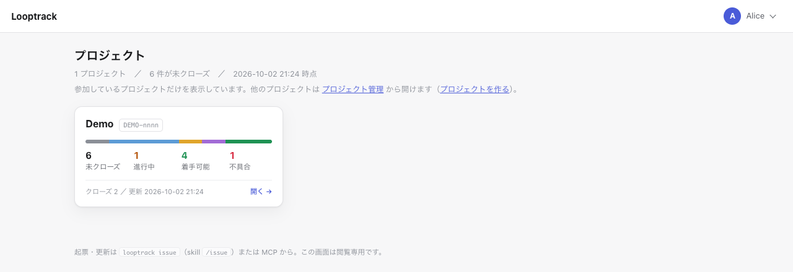

# サーバ版の始め方

[ガイドの目次](../README.md) · [サーバ版](README.md) · 前: [本システムの位置](../where-it-fits.md) · 次: [最初の 1 周](../daily-use.md#最初の-1-周)

何も入っていない PC から AI エージェントがサーバにつながるまでを扱います。このページではコマンドを省かずにその道のりを追います。
上から順に実行してください。
例では次の値を使います。自分の環境に合わせて読み替えればそれで構いません。

| 項目 | 例の値 |
| -- | -- |
| 版 | `v1.0.0` |
| サーバの置き場 | `~/looptrack-server`（Windows は `%USERPROFILE%\looptrack-server`） |
| サーバの URL（ローカル） | `http://127.0.0.1:8090/looptrack` |
| 管理者のログイン名 | `admin` |
| プロジェクトの slug / ID の接頭辞 | `demo` / `DEMO`（最初のイシューは `DEMO-0001`） |
| 作業するリポジトリ | `~/work/demo-app` |

## 0. 使い方を選ぶ

| 使い方 | 向いている場面 | 保存先 | ログイン |
| -- | -- | -- | -- |
| ローカルの 1 人利用 | 自分の PC だけで使う | SQLite（ファイル 1 つ） | 省く（127.0.0.1 だけで待ち受ける） |
| チームのサーバ | 複数の人で使う | MySQL か SQLite | ID・パスワード（+ 二段階認証） |

前提はローカルの 1 人利用です。
チームのサーバとの違いは手順 3 の後の「チームのサーバの場合」にまとめてあります。
チームのサーバがまっさらな Linux のマシンなら、手順 1〜3 はインストーラに任せて飛ばせます。詳しくは手順 3 の後の「まっさらな Linux サーバの場合」にあります。

Claude Code・Codex・GitHub Copilot など、使う AI は先に入れておきましょう。git も使います。
ほかに要るものはありません。
Looptrack は実行ファイル 1 つで、サーバも CLI も hook もそこから動きます。別の処理系（ランタイム）は要らないし、`looptrack issue init` がプロジェクトにスクリプトを置くこともありません。Windows でも同じです。

## 1. 実行ファイルを取得する

リリースのページ（https://github.com/howashoji/looptrack/releases ）から次の 2 つを落とします。

- `looptrack_<版>_<OS>_<CPU>_server.tar.gz`（Windows は `.zip`）: サーバ・CLI・hook をまとめた実行ファイル `looptrack` と、そのライセンス文を入れた書庫
- `SHA256SUMS`（ハッシュの一覧）

OS は `darwin`（macOS）・`linux`・`windows` のどれかです。CPU は `amd64`・`arm64` のどちらかです。
書庫を展開すると `looptrack_<版>_<OS>_<CPU>_server/` というフォルダが 1 つでき、中には `looptrack`（Windows は `looptrack.exe`）・`NOTICE`・`OFL-BIZUDGothic.txt`・`LICENSE` が入っています。

展開の前に書庫を `SHA256SUMS` で照合し、置き場は管理者権限の要らない場所にしてください。

### macOS / Linux

```bash
VER=v1.0.0
OS=darwin      # Linux は linux
ARCH=arm64     # Intel / AMD の CPU は amd64
NAME="looptrack_${VER}_${OS}_${ARCH}_server"
BASE="https://github.com/howashoji/looptrack/releases/download/$VER"
mkdir -p ~/.local/bin
TMP="$(mktemp -d)" && cd "$TMP"
curl -fsSL -O "$BASE/$NAME.tar.gz" -O "$BASE/SHA256SUMS"
grep -E " $NAME\.tar\.gz\$" SHA256SUMS | shasum -a 256 -c -   # Linux は sha256sum -c -
tar -xzf "$NAME.tar.gz"
install -m 755 "$NAME/looptrack" ~/.local/bin/looptrack
```

`shasum` の結果が `OK` かを必ず確かめてください。
`~/.local/bin` が PATH に無ければ、`~/.zshrc` や `~/.bashrc` といったシェルの設定に次の 1 行を足します。足したらターミナルを開き直しましょう。

```bash
export PATH="$HOME/.local/bin:$PATH"
```

### Windows（PowerShell）

管理者権限は要りません。
置き場は `%LOCALAPPDATA%\Programs\looptrack` です。

```powershell
$Ver = 'v1.0.0'
$Arch = 'amd64'   # ARM の PC は arm64
$D = Join-Path $env:LOCALAPPDATA 'Programs\looptrack'
New-Item -ItemType Directory -Force -Path $D | Out-Null
$Name = "looptrack_${Ver}_windows_${Arch}_server"
$Base = "https://github.com/howashoji/looptrack/releases/download/$Ver"
$Tmp = Join-Path ([IO.Path]::GetTempPath()) ([Guid]::NewGuid())
New-Item -ItemType Directory -Force -Path $Tmp | Out-Null
Invoke-WebRequest -UseBasicParsing -Uri "$Base/$Name.zip" -OutFile (Join-Path $Tmp "$Name.zip")
Invoke-WebRequest -UseBasicParsing -Uri "$Base/SHA256SUMS" -OutFile (Join-Path $Tmp 'SHA256SUMS')
$Line = Get-Content (Join-Path $Tmp 'SHA256SUMS') | Where-Object { ($_ -split '\s+', 2)[1] -eq "$Name.zip" }
if (-not $Line) { throw "SHA256SUMS に $Name.zip がありません" }
if ((Get-FileHash -Algorithm SHA256 -Path (Join-Path $Tmp "$Name.zip")).Hash -ne ($Line -split '\s+', 2)[0]) { throw "SHA-256 が一致しません: $Name.zip" } else { "OK $Name.zip" }
Expand-Archive -Path (Join-Path $Tmp "$Name.zip") -DestinationPath $Tmp -Force
Copy-Item (Join-Path $Tmp "$Name\looptrack.exe") (Join-Path $D 'looptrack.exe') -Force
$UserPath = [Environment]::GetEnvironmentVariable('Path', 'User')
if (($UserPath -split ';') -notcontains $D) { [Environment]::SetEnvironmentVariable('Path', "$UserPath;$D", 'User') }
```

`OK` が出ることを確かめてください。
ただ、PATH の変更が効くのは新しく開いたターミナルと新しく起動したアプリだけです。
PowerShell を開き直してから次に進んでください。

> **Windows の `looptrack issue verify` には Git Bash が要ります。** 検証コマンドは `bash -c` で実行し、
> `cmd.exe` や PowerShell では代わりに実行しません。POSIX の書き方のコマンドが別の意味になってしまうからです。`verify` を使うなら
> Git for Windows（`winget install --id Git.Git -e`）を入れてください。無いと `verify.require_on_close` の
> プロジェクトで「## 検証コマンド」節のあるイシューを閉じられません。見つかるかどうかは `looptrack doctor` で確かめられます。

### Windows（Git Bash）

Git Bash でも使えます。
取得は `OS=windows` にするだけで macOS / Linux の手順と同じです。Windows の書庫は `.zip` で、中の実行ファイルは `looptrack.exe` です。
展開には `unzip` を使います。Git Bash に `unzip` が無い？　それなら PowerShell の手順を使ってください。

```bash
VER=v1.0.0
OS=windows
ARCH=amd64     # ARM の PC は arm64
NAME="looptrack_${VER}_${OS}_${ARCH}_server"
BASE="https://github.com/howashoji/looptrack/releases/download/$VER"
mkdir -p ~/.local/bin
TMP="$(mktemp -d)" && cd "$TMP"
curl -fsSL -O "$BASE/$NAME.zip" -O "$BASE/SHA256SUMS"
grep -E " $NAME\.zip\$" SHA256SUMS | sha256sum -c -
unzip -q "$NAME.zip"
cp "$NAME/looptrack.exe" ~/.local/bin/looptrack.exe
```

ただし、Git Bash の `~/.local/bin` は PowerShell や AI から見えないことがあります。
AI から使うつもりなら PowerShell の手順で `%LOCALAPPDATA%\Programs\looptrack` に置くほうが確実です。

### 確かめる

```bash
looptrack version
```

### 署名と OS の警告

- macOS: 公式の macOS 版は、配布元の Apple Developer ID で署名し、Apple の公証（notarization）も通してあります。
  ブラウザで取得しても Gatekeeper に止められることはありません。
  ただ、フォークなど自分でビルドしたものには署名が付かない点に注意。
- Windows: **Windows 版はまだ署名していません。**
  ブラウザで取得したものを起動すると、Microsoft Defender SmartScreen の「Windows によって PC が保護されました」が出ることがあります。
  先に上の手順で SHA-256 が `SHA256SUMS` と一致するのを確かめ、それから「詳細情報」→「実行」で進めてください。
  `Invoke-WebRequest` で取得して PowerShell から起動するなら、ふつうこの画面は出ません。
- Windows 11 のスマート アプリ コントロール（Smart App Control）が「オン」の PC では、署名の無いアプリが止められます。Looptrack の Windows 版も同じ。
  SmartScreen と違って「詳細情報」→「実行」の道は無く、アプリごとに許可する手段もいまのところありません。
  状態は「Windows セキュリティ」→「アプリとブラウザー コントロール」→「スマート アプリ コントロール設定」で見られる。
  「オン」「評価」「オフ」のどれかで、「評価」の間は何も止めません。
  「オン」なら使える道はその PC で機能を「オフ」にするか、別の PC で使うかです。
  切るかどうかは利用者が決めること。このガイドは切るよう勧めはしません。
  切った後に入れ直せるかは Windows の版しだいです。[Microsoft の FAQ](https://support.microsoft.com/en-us/windows/smart-app-control-frequently-asked-questions-285ea03d-fa88-4d56-882e-6698afdb7003) は最近の更新でクリーン インストールなしに入れ直せると書いていますが、古い文書にはクリーン インストールのときだけとある。
- 会社の管理下の PC では、管理者が署名の無いアプリを止める方針（App Control for Business・AppLocker）を入れていることがあります。
  そうなると利用者の側では回避できないので、管理者に相談してください。
  署名の無いアプリもファイルのハッシュでなら許可できる。けどハッシュは Looptrack の版ごとに変わるので、1 つの許可が効くのは 1 つの版だけです。
- `SHA256SUMS` には minisign の署名が付いています。リリースのページの `SHA256SUMS.minisig` がそれ。
  `looptrack self-update` はこの署名を確かめてから置き換えます。
  手で確かめたいなら [minisign](https://jedisct1.github.io/minisign/) を入れ、`SHA256SUMS.minisig` を `SHA256SUMS` と同じ場所に落として次を実行します。

```bash
minisign -Vm SHA256SUMS -P RWRrJP/r1wfXKalGsxLnzFmmsExUd2azSJh4ccrYDJEBu8yE3N0ZlLJy
```

`Signature and comment signature verified` と出れば一致しています。

## 2. サーバを立ち上げる（`looptrack setup`）

サーバの置き場を作って対話式のウィザードを走らせます。

```bash
mkdir -p ~/looptrack-server
cd ~/looptrack-server
looptrack setup
```

PowerShell ならこうです。

```powershell
New-Item -ItemType Directory -Force -Path "$HOME\looptrack-server" | Out-Null
Set-Location "$HOME\looptrack-server"
looptrack setup
```

問いへの答えは次のとおりです。`[ ]` の中の既定値は Enter を押すだけで選ばれます。

| 問い | ローカルの 1 人利用での答え |
| -- | -- |
| ① 使い方 | ローカルの 1 人利用（既定） |
| ② 保存先 | SQLite（既定。ファイルは `<置き場>/im.db`） |
| ③ 待ち受け | ポート `8090`・URL の接頭辞 `/looptrack`（既定） |
| ④ 最初の管理者 | ログイン名 `admin`・表示名・パスワード（12 文字以上。2 回入力） |
| ⑤ 二段階認証 | 任意（ローカルの既定）。ローカルではログインを省くので影響しません |
| ⑥ 最初のプロジェクト | `-`。ここでは作らず、手順 4 で `demo` を作ります。slug を入れるとここで作られるので、手順 4 は飛ばせます |

最後に内容を確かめて `y` を入れれば次のものができあがります。

- `<置き場>/.env`: 設定です。秘密を含むので、他人に見せたり git に入れたりしないでください
- `<置き場>/im.db`: SQLite のデータです
- 最初の管理者

終わると起動のコマンド・ブラウザの URL・CLI のログイン方法・MCP の接続設定が表示されます。

**`.env` の `LOOPTRACK_SECRET_KEY` を失うと全員の二段階認証が使えなくなります。** `.env` は別の場所にも控えておきましょう。

途中で Ctrl-C を押してやめても、ファイルも利用者も残りません。
2 回目の `looptrack setup` は何も書き換えずに今の設定を表示するだけです。作り直すなら `looptrack setup --force` です。

## 3. サーバを起動する

```bash
cd ~/looptrack-server
looptrack serve --env-file ./.env
```

PowerShell では `looptrack serve --env-file .\.env` を実行します。
このターミナルは閉じるとサーバが止まるので開いたままにしてください。
ブラウザで http://127.0.0.1:8090/looptrack/ を開いて画面が出るか確かめてください。ローカルの 1 人利用ならログインの画面は出ません。

ローカルモードは `127.0.0.1` だけで待ち受けます。
**複数の人が使う PC では使わないでください。** 同じ PC のほかの利用者が認証なしで操作できてしまいます。

### チームのサーバの場合

- ① で「チームのサーバ」を選びます。保存先の既定は MySQL で、接続先は環境変数 `LOOPTRACK_SETUP_DSN` で渡します。
- ③ で公開 URL（例 `https://im.example.com`）を入れます。二段階認証は既定で必須です。
- `.env` と一緒に `compose.yaml` とそれが使う `Dockerfile`・`NOTICE` ができます。
  起動は `docker compose up -d`。イメージは手元で作り、レジストリからは取ってきません。
  Linux ではウィザードが自分自身を `looptrack` として複製します。ほかの OS では `linux/amd64` の実行ファイルを先に置いてください。
- 外からは Nginx などのリバースプロキシで `/looptrack/` を受け、`127.0.0.1:8090` へ渡します。接頭辞 `/looptrack` は外さずに渡します。
- 手順 4 の管理コマンドは `looptrack …` の代わりに `docker compose run --rm --no-deps looptrack …` で実行します（例 `docker compose run --rm --no-deps looptrack user list`）。
- `--yes` による非対話の実行や MySQL の権限の分け方は、[docs/server/DEPLOY.md](../../../server/DEPLOY.md) の「新しく立ち上げる」にあります。

### まっさらな Linux サーバの場合（`install.sh`）

まっさらな Ubuntu LTS や Debian のサーバなら、手順 1〜3 を手で進めなくて構いません。
1 行でインストーラが走ります。サーバ版の書庫の取得・照合・展開・`looptrack setup`・systemd の unit か `compose.yaml` の作成・起動・動作確認まで進みます。

```bash
curl -fsSL https://raw.githubusercontent.com/howashoji/looptrack/main/deploy/install.sh | sudo sh
```

インストーラは最新のリリースの `looptrack_<版>_linux_<arch>_server.tar.gz` を取ります。`SHA256SUMS`（サーバに `minisign` があればその署名も）で照合してから展開し、入れます。
ところが、スクリプト自身は HTTPS で取るだけで、自分を照合できません。先に中身を読むなら `curl -fsSL -o install.sh https://raw.githubusercontent.com/howashoji/looptrack/main/deploy/install.sh` で落として読んでから `sudo sh install.sh` で実行してください。
オプションは `sh -s --` の後ろに置きます（版を固定するなら `… | sudo sh -s -- --version v1.0.0`）。
手元で作った配布物から入れるときはそのディレクトリを渡します（`sudo sh deploy/install.sh --from /path/to/dist`）。

インストーラは Linux 専用です。macOS や Windows でサーバを動かすなら[デスクトップ版](../desktop/README.md)を使ってください。

最初の問いは systemd と Docker compose のどちらで動かすかです。続けて `looptrack setup` と同じことを聞かれます。
終わると Nginx と Caddy の設定例・ブラウザの URL・CLI のログイン方法・MCP の接続設定が表示されます。設定例は `/etc/looptrack/proxy-examples.txt` にも書き出されます。
リバースプロキシを前に置いて公開 URL でログインしたら、手順 4 へ進んでください。

保存先に MySQL を選び、`deploy/grants.sql` でアプリ用の DB 利用者に必要な権限だけを与えます。この場合も同じ 1 回の実行で進みます。
表ごとの `GRANT` は表ができてからでないと流せません。だから setup が表を作った後で、インストーラが MySQL の管理用の資格情報を端末で尋ねます（パスワードは表示しません。保存もしません）。
アプリ用の利用者が無ければ作り、`looptrack` に埋め込んだ権限を与えます（中身は `looptrack grants print` で見られます）。アプリ用の利用者で読めるのを確かめてから起動する流れです。
管理用の資格情報が合わなければ何も起動せずに止まり、もう一度実行すれば尋ねるところから続きます。
DB がまだ無ければ setup が同じ管理用の資格情報を先に尋ね、作ってよいかを確かめてから DB も作ります（尋ねるのは 1 回だけです）。表を作る利用者（`LOOPTRACK_SETUP_MIGRATE_DSN`）と、その DB への `GRANT` の 2 つは先に用意しておきます（無ければ従来どおり接続で止まります）。作らないと答えると何も作らずに止まり、自分で流す `CREATE DATABASE` の文を示します。

更新は `curl -fsSL https://raw.githubusercontent.com/howashoji/looptrack/main/deploy/install.sh | sudo sh -s -- --upgrade` です（詳しくは[更新](updating.md)）。アンインストールは `--uninstall` で、`--purge` を付ければ設定とデータも消えます。

## 4. プロジェクトを作り、自分を参加させる

ウィザードの質問 ⑥ でプロジェクトを作ったならこの手順は飛ばしてください。同じ slug をもう一度作ろうとすると失敗します。
ブラウザの画面（`/admin/projects` の「プロジェクトを作る」）から後で作ることもできます。

プロジェクトは管理コマンドで作ります。
管理コマンドは `.env` の `LOOPTRACK_DSN` を使って保存先につなぎます。
実行するのはサーバを起動したのとは別のターミナルです。

macOS / Linux / Git Bash:

```bash
cd ~/looptrack-server
set -a; . ./.env; set +a
looptrack project create demo --prefix DEMO --name "Demo" --description "Looptrack を試すプロジェクト"
looptrack member set demo admin --role admin
looptrack project list
```

PowerShell:

```powershell
Set-Location "$HOME\looptrack-server"
Get-Content .\.env | ForEach-Object { if ($_ -match "^([A-Z_]+)='(.*)'$") { Set-Item -Path "Env:$($Matches[1])" -Value $Matches[2] } }
looptrack project create demo --prefix DEMO --name "Demo" --description "Looptrack を試すプロジェクト"
looptrack member set demo admin --role admin
looptrack project list
```

- `--prefix`（ID の接頭辞）と `--width`（連番の桁数。既定 4）は**後から変えられません**。
- 管理者でも参加していないプロジェクトは読むだけです。書くには `member set` で editor か admin として参加させます。
- ブラウザの http://127.0.0.1:8090/looptrack/ に `demo` が出れば成功です。

イシューをいくつか起票した後ならプロジェクトの選択の画面は次のようになります。



## 5. 利用者と権限（チームのサーバの場合）

ローカルの 1 人利用ならこの手順は要りません。
チームのサーバでは管理者がブラウザで利用者を足します。

1. `<サーバの URL>/admin/users` を開き、ログイン名・表示名・初期パスワード・役割（admin / member）を入れて追加します。
2. 同じ画面の「プロジェクトの権限」で、プロジェクトに `editor`（起票・コメント・状態の変更）か `viewer`（閲覧のみ）を付けます。
3. 利用者に URL・ログイン名・初期パスワードを伝えます。利用者はログインし、二段階認証が必須なら認証アプリを登録します。パスワードは `<サーバの URL>/account` で変えられます。

詳しくは[管理者の手引き](admin.md)にあります。

## 6. CLI にログインする（`looptrack issue login`）

ローカルの 1 人利用ならこの手順は要りません。画面や AI の MCP と同じく、CLI もトークンなしでそのまま使えます。
ログインが要るのはチームのサーバに向けるときだけです。

```bash
looptrack issue login --browser --url http://127.0.0.1:8090/looptrack
```

ブラウザが開いたらログインして「許可」を押します。ローカルの 1 人利用ではログインの画面は出ません。
ブラウザが開かない？　なら表示された URL を開いてください。
トークンは手元の設定ディレクトリに本人だけが読める形で保存されます。macOS と Linux では `~/.config/looptrack/credentials.json`、Windows では `%APPDATA%\looptrack\credentials.json` です。
以後は期限が近づくと自動で更新されます。

ssh の先のようにブラウザの無い環境もあります。そのときは `<サーバの URL>/account` でアクセストークンを発行して、次のコマンドに貼り付けます。

```bash
looptrack issue login --url http://127.0.0.1:8090/looptrack
```

## 7. プロジェクトに導入する（`looptrack issue init`）

作業するリポジトリで実行します。
まずは `--dry-run` で何が書かれるかを見ておきましょう。

```bash
mkdir -p ~/work/demo-app
cd ~/work/demo-app
git init
looptrack issue init --project demo --url http://127.0.0.1:8090/looptrack --agent claude-code --mcp --dry-run
looptrack issue init --project demo --url http://127.0.0.1:8090/looptrack --agent claude-code --mcp --no-loop
```

- `--agent` には使う AI を指定します。`claude-code`・`codex`・`copilot`・`other` から選び、複数ならカンマで区切ります（例 `claude-code,codex`）。
- `--mcp` を付けると MCP の接続設定も書きます。Claude Code なら `.mcp.json` です。
- `--no-loop` は core だけを入れます。loop も入れるなら `--loop` にします。どちらも付けないと対話で尋ねられます。選び方は [AI ごとの手引き](../ai-agents.md) にあります。
- 既存の設定は消さずにマージします。変えたファイルは `.claude/.looptrack-init-backup/<時刻>/` に控えます。
- 導入の後に自己診断が走ります。失敗したら書いたものは元に戻ります。
- 再実行しても壊れません。2 回目は「変更はありません」と出るだけです。

Claude Code なら入るのは主に次のものです。

| もの | 中身 |
| -- | -- |
| `.claude/settings.json` の `env` | `LOOPTRACK_API_URL` と `LOOPTRACK_PROJECT`。トークンは書きません |
| `.claude/settings.json` の hooks | セッション開始の要約・鮮度ガード・トークン計測（`looptrack hook …`） |
| `.claude/skills/issue/` | skill `/issue` |
| `CLAUDE.md` | `<!-- looptrack:begin -->` から `<!-- looptrack:end -->` までの案内の節 |
| `.mcp.json` | MCP の接続設定（`--mcp` のとき） |

PATH で `looptrack` が見つからないときは hook を絶対パスで配線します。その配線は手元専用の `.claude/settings.local.json` に書かれます。
配線と PATH はこれで確かめられます。

```bash
looptrack doctor
```

## 8. MCP を接続する

`init --mcp` を使ったなら Claude Code の接続設定はもうできています。
手で足すならこうです。

```bash
claude mcp add --transport http looptrack http://127.0.0.1:8090/looptrack/mcp --header "X-Looptrack-Project: demo"
```

`.mcp.json` に書くなら次の形になります。

```json
{ "mcpServers": { "looptrack": { "type": "http", "url": "http://127.0.0.1:8090/looptrack/mcp",
  "headers": { "X-Looptrack-Project": "demo" } } } }
```

Claude Code を起動し直してください。
hook の確認を求められたら内容を見てから承認します。
チームのサーバでは Claude Code の `/mcp` で `looptrack` を選び、ブラウザで許可します。
Codex・Copilot の接続は [AI ごとの手引き](../ai-agents.md) にまとめてあります。

## 9. つながったかを確かめる

まずは CLI でつながっているかを確かめます。

```bash
cd ~/work/demo-app
export LOOPTRACK_API_URL=http://127.0.0.1:8090/looptrack LOOPTRACK_PROJECT=demo
looptrack issue config
looptrack issue guide
```

なぜ 2 つの環境変数を自分で設定するのか。`init` がこれを `.claude/settings.json` に書くからです。そこに書いた値は AI のセッションにしか渡らず、ふつうのターミナルからは見えません。
`config` にプロジェクト `demo` と自分の権限が出れば成功です。

これで AI もターミナルもサーバにつながりました。
ここから先の流れはデスクトップ版と同じです。日々の使い方の[最初の 1 周](../daily-use.md#最初の-1-周)へ進み、このプロジェクト `demo` で 1 周回してください。
表示の言語（日本語か英語か）の決め方は[表示の言語](../daily-use.md#表示の言語日本語--英語)にあります。
