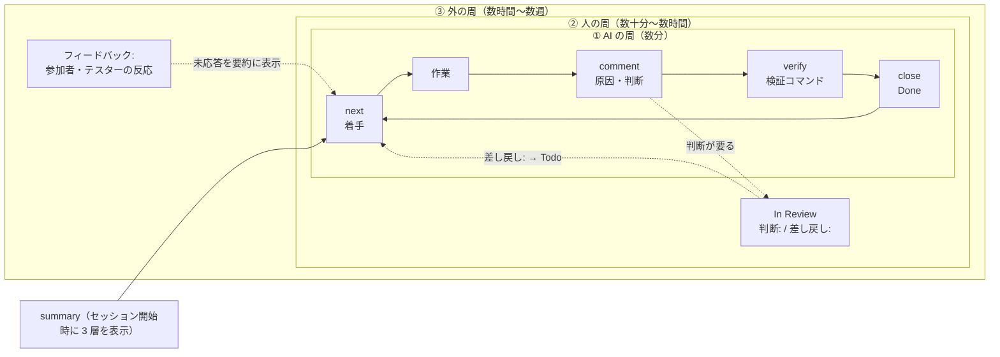

# 本システムの位置: 3 層のどこに何が当たるか

[ガイドの目次](README.md) · 前: [概念](concepts.md) · 次: [始め方](getting-started.md)

## 全体の図



図が表示されないときは、次の文字の図を見てください。

```
+-- ③ 外の周 ------------------------------------------------------+
|  フィードバック: …  （参加者・テスターの反応。未応答は summary の ③） |
|  +-- ② 人の周 ------------------------------------------------+  |
|  |  In Review → 判断: （Done へ） / 差し戻し: （Todo へ）         |  |
|  |  +-- ① AI の周 ------------------------------------------+  |  |
|  |  |  next → 作業 → comment → verify → close → next …     |  |  |
|  |  +-------------------------------------------------------+  |  |
|  +-------------------------------------------------------------+  |
+-------------------------------------------------------------------+
  セッション開始時の summary が ①②③ を毎回 AI に見せる
```

## 3 層に当たる機能

| 機能 | 当たる層 | 何をするか |
| -- | -- | -- |
| `next` | ① | 自分が着手中のイシューを返します。無ければ着手できるうち最上位のものを In Progress にして、本文・受け入れ条件・関連を返します |
| `verify` と「## 検証コマンド」 | ① | 本文に書いたコマンドを手元で実行し、結果をイシューに記録します |
| `close --comment` | ① | 受け入れ条件の検証結果を残して Done にします |
| `summary` の 3 層表示 | ①②③ | 「① いまの周」「② 人の判断待ち」「③ 外からの反応」を並べます。セッション開始の hook が毎回 AI に見せます |
| In Review | ② | 人の判断が要るものを置く状態です。48 時間を超えて止まっていると印が付きます |
| `判断:` / `差し戻し:` コメント | ② | 人の返答を残す形です。AI はこれを見て Done か Todo に動かします |
| `フィードバック:` コメント | ③ | 外からの反応を残す形です。応答が付くまで「未応答」として並びます |
| プロジェクト別ルール | ①② | サーバが状態の変更を検査します（下の表） |
| トークン計測 | ①②③ | AI の操作ごとに会話のトークン消費をイシューに記録します |
| kit の hook | ①② | イシューを更新せずに終えるといった AI の逸脱を見つけて、やり直しを求めます |

## プロジェクト別ルール

サーバが守らせる規則はプロジェクトごとに足せます。
設定するのは管理者です。詳しくは[管理者の手引き](admin.md)を見てください。

| ルール | 働き |
| -- | -- |
| 検証の必須化（`verify.require_on_close`） | 「## 検証コマンド」節のあるイシューは、今の本文に対する直近の `verify` が全件成功でないと Done にできません |
| トークン情報の必須化（`usage.require_on_close`） | AI が Done / Canceled にするとき、その会話のトークン情報がイシューに無いと拒否します |

拒否されたときは、次にすることがメッセージに書いてあります。
上書きの `--override "理由"` は、利用者がはっきり求めたときだけ使ってください。
理由はサーバに記録されます。

## トークン計測

CLI の変更操作と hook が、AI の会話のトークン消費をサーバへ送ります。
消費は起票・コメント・状態の変更といった、そのイシューへの操作の段階ごとに貯まります。
`looptrack issue usage show <ID>` で段階ごとの内訳を見られます。
期間ごとの集計と PDF のレポートも作れます。

## kit の hook（core と loop）

kit は `looptrack issue init` がプロジェクトに入れます。

| 層 | 入れ方 | 主な中身 |
| -- | -- | -- |
| core | 必ず入る | セッション開始時の 3 層の要約・鮮度ガード（参照したイシューを更新せずに終えるとやり直しを求める）・トークン計測・skill `/issue` |
| loop | 利用者が選ぶ | 出力の規律・作業の規律・確認モード（「確認して」で編集を止める）・引き継ぎの鮮度・イテレーションの規律と skill `/iterate`・文脈の大きさの警告・背景プロセスの検知・別リポジトリへの変更の確認 |

core だけでも ① の周は回ります。
loop を足すと逸脱の検知を hook に任せられるので、人は判断に集中できます。
loop を入れるかどうかを決めるのは AI ではなく利用者です。
