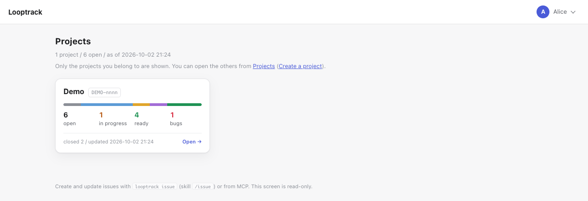

# Getting started with the server

[Guide contents](../README.md) · [Server edition](README.md) · Previous: [Where Looptrack fits](../where-it-fits.md) · Next: [Your first loop](../daily-use.md#your-first-loop)

From a machine with nothing installed to an AI agent connected to your server. That's the path this page walks, with every command spelled out.
Run the steps in order.
The examples use the values below. Swap in your own.

| Item | Example value |
| -- | -- |
| Version | `v1.0.0` |
| Server directory | `~/looptrack-server` (Windows: `%USERPROFILE%\looptrack-server`) |
| Server URL (local) | `http://127.0.0.1:8090/looptrack` |
| Administrator login | `admin` |
| Project slug / ID prefix | `demo` / `DEMO` (the first issue is `DEMO-0001`) |
| Repository you work in | `~/work/demo-app` |

## 0. Choose how you will run it

| Mode | Good for | Storage | Sign-in |
| -- | -- | -- | -- |
| Local, single user | Using it on your own machine only | SQLite (a single file) | Skipped (listens on 127.0.0.1 only) |
| Team server | Several people | MySQL or SQLite | Login and password (+ two-factor auth) |

We'll assume the local, single-user setup here.
The differences for a team server are collected under "For a team server" after step 3.
If the team server is a bare Linux machine, you can skip steps 1 to 3 entirely and let the installer do them. See "On a bare Linux server" after step 3.

Install the agent you plan to use (Claude Code, Codex, GitHub Copilot, …) before you begin. You'll need git too.
Anything else? No.
Looptrack is a single executable, and the server, the CLI and the hooks all run from it. There's no runtime to install (no separate runtime), and `looptrack issue init` doesn't write any scripts into your project. Same on Windows.

## 1. Download the binaries

Grab these two files from the releases page (https://github.com/howashoji/looptrack/releases ):

- `looptrack_<version>_<os>_<arch>_server.tar.gz` (`.zip` on Windows): an archive holding one binary, `looptrack`, for the server, the CLI, and the hooks, together with its license texts
- `SHA256SUMS` (the checksums)

`<os>` is `darwin` (macOS), `linux`, or `windows`. `<arch>` is `amd64` or `arm64`.
The archive unpacks into a single folder, `looptrack_<version>_<os>_<arch>_server/`, holding `looptrack` (`looptrack.exe` on Windows), `NOTICE`, `OFL-BIZUDGothic.txt`, and `LICENSE`.

Check the archive against `SHA256SUMS` before you unpack it.
And put the binary somewhere that doesn't need administrator rights.

### macOS / Linux

```bash
VER=v1.0.0
OS=darwin      # linux on Linux
ARCH=arm64     # amd64 on Intel / AMD CPUs
NAME="looptrack_${VER}_${OS}_${ARCH}_server"
BASE="https://github.com/howashoji/looptrack/releases/download/$VER"
mkdir -p ~/.local/bin
TMP="$(mktemp -d)" && cd "$TMP"
curl -fsSL -O "$BASE/$NAME.tar.gz" -O "$BASE/SHA256SUMS"
grep -E " $NAME\.tar\.gz\$" SHA256SUMS | shasum -a 256 -c -   # on Linux: sha256sum -c -
tar -xzf "$NAME.tar.gz"
install -m 755 "$NAME/looptrack" ~/.local/bin/looptrack
```

Make sure the checksum output says `OK`.
If `~/.local/bin` isn't on your PATH, add this line to your shell profile (`~/.zshrc`, `~/.bashrc`, …), then open a new terminal.

```bash
export PATH="$HOME/.local/bin:$PATH"
```

### Windows (PowerShell)

No administrator rights needed.
The binary goes in `%LOCALAPPDATA%\Programs\looptrack`.

```powershell
$Ver = 'v1.0.0'
$Arch = 'amd64'   # arm64 on ARM PCs
$D = Join-Path $env:LOCALAPPDATA 'Programs\looptrack'
New-Item -ItemType Directory -Force -Path $D | Out-Null
$Name = "looptrack_${Ver}_windows_${Arch}_server"
$Base = "https://github.com/howashoji/looptrack/releases/download/$Ver"
$Tmp = Join-Path ([IO.Path]::GetTempPath()) ([Guid]::NewGuid())
New-Item -ItemType Directory -Force -Path $Tmp | Out-Null
Invoke-WebRequest -UseBasicParsing -Uri "$Base/$Name.zip" -OutFile (Join-Path $Tmp "$Name.zip")
Invoke-WebRequest -UseBasicParsing -Uri "$Base/SHA256SUMS" -OutFile (Join-Path $Tmp 'SHA256SUMS')
$Line = Get-Content (Join-Path $Tmp 'SHA256SUMS') | Where-Object { ($_ -split '\s+', 2)[1] -eq "$Name.zip" }
if (-not $Line) { throw "$Name.zip is not in SHA256SUMS" }
if ((Get-FileHash -Algorithm SHA256 -Path (Join-Path $Tmp "$Name.zip")).Hash -ne ($Line -split '\s+', 2)[0]) { throw "SHA-256 mismatch: $Name.zip" } else { "OK $Name.zip" }
Expand-Archive -Path (Join-Path $Tmp "$Name.zip") -DestinationPath $Tmp -Force
Copy-Item (Join-Path $Tmp "$Name\looptrack.exe") (Join-Path $D 'looptrack.exe') -Force
$UserPath = [Environment]::GetEnvironmentVariable('Path', 'User')
if (($UserPath -split ';') -notcontains $D) { [Environment]::SetEnvironmentVariable('Path', "$UserPath;$D", 'User') }
```

Make sure you see an `OK` line.
But the PATH change only applies to terminals and apps started afterwards.
So open a new PowerShell window before you continue.

> **`looptrack issue verify` needs Git Bash on Windows.** Verification commands run under `bash -c`, and
> Looptrack does not fall back to `cmd.exe` or PowerShell (a POSIX command line means something else there).
> Install Git for Windows — `winget install --id Git.Git -e` — if you want `verify`. Without it you cannot
> close an issue that has a `## Verify commands` section in a project with `verify.require_on_close`.
> `looptrack doctor` says whether it found a shell.

### Windows (Git Bash)

Git Bash works too.
Follow the macOS / Linux steps, just with `OS=windows`. The Windows archive is a `.zip`, and the binary inside it is `looptrack.exe`.
Unpacking uses `unzip`. No `unzip` in your Git Bash? Use the PowerShell steps instead.

```bash
VER=v1.0.0
OS=windows
ARCH=amd64     # arm64 on ARM PCs
NAME="looptrack_${VER}_${OS}_${ARCH}_server"
BASE="https://github.com/howashoji/looptrack/releases/download/$VER"
mkdir -p ~/.local/bin
TMP="$(mktemp -d)" && cd "$TMP"
curl -fsSL -O "$BASE/$NAME.zip" -O "$BASE/SHA256SUMS"
grep -E " $NAME\.zip\$" SHA256SUMS | sha256sum -c -
unzip -q "$NAME.zip"
cp "$NAME/looptrack.exe" ~/.local/bin/looptrack.exe
```

One catch: PowerShell and your agent may not see Git Bash's `~/.local/bin`.
If an agent will call `looptrack`, you're better off installing into `%LOCALAPPDATA%\Programs\looptrack` with the PowerShell steps.

### Check

```bash
looptrack version
```

### Signatures and OS warnings

- macOS: the official macOS binaries are signed with the publisher's Apple Developer ID and notarized by Apple.
  Gatekeeper won't block them, even when you download them with a browser.
  Binaries you build yourself (for example, from a fork) aren't signed, though.
- Windows: the Windows binaries are **currently not signed**.
  Start one you downloaded with a browser, and Microsoft Defender SmartScreen may show "Windows protected your PC".
  First check that the SHA-256 matches `SHA256SUMS` (the steps above). Then click More info → Run anyway.
  Files downloaded with `Invoke-WebRequest` and started from PowerShell usually don't show this screen.
- On Windows 11, Smart App Control blocks apps that aren't signed when it is turned on, and that includes the Looptrack binaries.
  Unlike SmartScreen, it has no More info → Run anyway, and there is currently no way to allow a single app.
  To see its state, open Windows Security → App & browser control → Smart App Control settings.
  It is On, Evaluation or Off. In Evaluation it blocks nothing.
  If it is On, you can turn it Off on that PC or use Looptrack on another PC.
  Whether to turn it off is your decision, and this guide doesn't recommend it.
  Turning it back on later depends on your Windows version: [Microsoft's FAQ](https://support.microsoft.com/en-us/windows/smart-app-control-frequently-asked-questions-285ea03d-fa88-4d56-882e-6698afdb7003) says recent updates let you do it without a clean install, while older documentation says only a clean install will.
- On a PC your organization manages, an administrator may have a policy that blocks unsigned apps (App Control for Business or AppLocker).
  You can't get around that yourself, so talk to the administrator.
  Unsigned apps can be allowed by file hash, but the hash changes with every version of Looptrack, so a hash rule covers one version only.
- `SHA256SUMS` is signed with minisign. That's `SHA256SUMS.minisig` on the releases page.
  `looptrack self-update` checks this signature before replacing itself.
  Want to check it by hand? Install [minisign](https://jedisct1.github.io/minisign/), download `SHA256SUMS.minisig` next to `SHA256SUMS`, and run:

```bash
minisign -Vm SHA256SUMS -P RWRrJP/r1wfXKalGsxLnzFmmsExUd2azSJh4ccrYDJEBu8yE3N0ZlLJy
```

You should see `Signature and comment signature verified`.

## 2. Set up the server (`looptrack setup`)

Make a directory for the server, then run the interactive wizard.

```bash
mkdir -p ~/looptrack-server
cd ~/looptrack-server
looptrack setup
```

In PowerShell:

```powershell
New-Item -ItemType Directory -Force -Path "$HOME\looptrack-server" | Out-Null
Set-Location "$HOME\looptrack-server"
looptrack setup
```

Here's how to answer. Values in `[ ]` are defaults, and pressing Enter accepts them.

| Question | Answer for local, single-user use |
| -- | -- |
| ① Mode | Local, single user (default) |
| ② Storage | SQLite (default; the file is `<server directory>/im.db`) |
| ③ Listening | Port `8090`, URL prefix `/looptrack` (defaults) |
| ④ First administrator | Login `admin`, display name, password (12+ characters, entered twice) |
| ⑤ Two-factor auth | Optional (the local default; it has no effect because local mode skips sign-in) |
| ⑥ First project | `-` (create none here; step 4 creates `demo`. Entering a slug creates it now and you can skip step 4) |

Review the summary and enter `y`. You end up with:

- `<server directory>/.env` (settings; it contains secrets, so do not share it or commit it)
- `<server directory>/im.db` (the SQLite data)
- the first administrator

When it finishes, it prints the start command, the browser URL, the CLI login command, and the MCP connection settings.

**If you lose `LOOPTRACK_SECRET_KEY` in `.env`, nobody's two-factor auth will work any more.** Keep a copy of `.env` somewhere safe.

Stop with Ctrl-C part-way, and no files and no users are left behind.
Run `looptrack setup` a second time and it changes nothing. It just shows the current settings. To start over, run `looptrack setup --force`.

## 3. Start the server

```bash
cd ~/looptrack-server
looptrack serve --env-file ./.env
```

In PowerShell: `looptrack serve --env-file .\.env`.
Leave this terminal open. Closing it stops the server.
Open http://127.0.0.1:8090/looptrack/ in a browser and check that the page loads. In local, single-user mode you won't see a login page.

Local mode listens on `127.0.0.1` only.
**Do not use it on a machine shared by several people.** Other users on the same machine could use it without signing in.

### For a team server

- In ①, choose "team server". The default storage is MySQL; pass the MySQL connection string in the environment variable `LOOPTRACK_SETUP_DSN`.
- In ③, enter the public URL (e.g. `https://im.example.com`). Two-factor auth defaults to required.
- The wizard writes a `compose.yaml` next to `.env`, plus the `Dockerfile` and `NOTICE` it builds from.
  Start it with `docker compose up -d`. The image is built locally, not pulled.
  On Linux the wizard also copies itself there as `looptrack`; elsewhere, put a `linux/amd64` build there first.
- Put a reverse proxy (Nginx, …) in front: receive `/looptrack/` and pass it to `127.0.0.1:8090`. Do not strip the `/looptrack` prefix.
- For the admin commands in step 4, use `docker compose run --rm --no-deps looptrack …` instead of `looptrack …` (e.g. `docker compose run --rm --no-deps looptrack user list`).
- Non-interactive runs (`--yes`) and how to split MySQL privileges are described under 「新しく立ち上げる」 in [docs/server/DEPLOY.md](../../server/DEPLOY.md).

### On a bare Linux server (`install.sh`)

On a fresh Ubuntu LTS or Debian server, you don't have to do steps 1 to 3 by hand.
One line runs the installer. It downloads the server archive, verifies it, unpacks it, runs `looptrack setup`, writes a systemd unit (or a `compose.yaml`), starts the service and checks that it answers.

```bash
curl -fsSL https://raw.githubusercontent.com/howashoji/looptrack/main/deploy/install.sh | sudo sh
```

The installer takes `looptrack_<version>_linux_<arch>_server.tar.gz` of the newest release. It checks it against `SHA256SUMS` (and the signature of `SHA256SUMS` when the server has `minisign`) before it unpacks or installs anything.
The script itself, though, is fetched over HTTPS only and can't check itself. To read it first, download it with `curl -fsSL -o install.sh https://raw.githubusercontent.com/howashoji/looptrack/main/deploy/install.sh`, read it, and run `sudo sh install.sh`.
Options go after `sh -s --` (for example `… | sudo sh -s -- --version v1.0.0` to pin a version).
If you built the distribution yourself, pass that directory instead: `sudo sh deploy/install.sh --from /path/to/dist`.

The installer is for Linux only. On macOS or Windows, use the [desktop edition](../desktop/README.md) to run a server.

First it asks how to run the server (systemd or Docker compose). Then come the same questions as `looptrack setup`.
When it finishes, it prints Nginx and Caddy configuration examples (also written to `/etc/looptrack/proxy-examples.txt`), the browser URL, the CLI login command and the MCP connection settings.
Put the reverse proxy in front, sign in at the public URL, and carry on from step 4.

Choosing MySQL and giving the application's database user only the privileges it needs (`deploy/grants.sql`)? The same run takes care of that too.
Per-table `GRANT`s can only run once the tables exist. So after setup creates the tables, the installer asks on the terminal for an administrative MySQL account (the password isn't shown and isn't stored).
It creates the application user if it's missing, grants the privileges built into `looptrack` (`looptrack grants print` shows them), checks that the application user can read, and only then starts the service.
If the administrative account is wrong, it stops without starting anything. Run it again and it picks up from the question.
If the database does not exist yet, setup asks for the same administrative account up front and, after asking whether to go ahead, creates the database too (you are asked only once). This needs the user that creates the tables (`LOOPTRACK_SETUP_MIGRATE_DSN`) and its `GRANT` on that database to be in place first; without them it stops at the connection as before. Answer no and it stops without creating anything, showing the `CREATE DATABASE` statement to run yourself.

To update, run `curl -fsSL https://raw.githubusercontent.com/howashoji/looptrack/main/deploy/install.sh | sudo sh -s -- --upgrade` (details in [Updating](updating.md)). To remove it, use `--uninstall`. Add `--purge` and the settings and the data go too.

## 4. Create a project and join it

Already created a project at question ⑥ of the wizard? Then skip this step. Re-creating the same slug fails.
You can also create one from the browser later (`/admin/projects`, "Create project").

Projects are created with an admin command.
Admin commands reach storage through `LOOPTRACK_DSN` in `.env`.
Run them in a different terminal from the one running the server.

macOS / Linux / Git Bash:

```bash
cd ~/looptrack-server
set -a; . ./.env; set +a
looptrack project create demo --prefix DEMO --name "Demo" --description "A project for trying Looptrack"
looptrack member set demo admin --role admin
looptrack project list
```

PowerShell:

```powershell
Set-Location "$HOME\looptrack-server"
Get-Content .\.env | ForEach-Object { if ($_ -match "^([A-Z_]+)='(.*)'$") { Set-Item -Path "Env:$($Matches[1])" -Value $Matches[2] } }
looptrack project create demo --prefix DEMO --name "Demo" --description "A project for trying Looptrack"
looptrack member set demo admin --role admin
looptrack project list
```

- `--prefix` (the ID prefix) and `--width` (digits in the number; default 4) **cannot be changed later**.
- Even an administrator can only read a project they have not joined. To write, join it as editor or admin with `member set`.
- If `demo` appears at http://127.0.0.1:8090/looptrack/, it worked.

Here is the project picker once a few issues have been filed.



## 5. Users and permissions (team server)

Local, single-user? Skip this step.
On a team server, an administrator adds users in the browser.

1. Open `<server URL>/admin/users` and add a user with a login, display name, initial password, and role (admin / member)
2. On the same page, under project permissions, give the user `editor` (create, comment, change status) or `viewer` (read only) on the project
3. Send the user the URL, login, and initial password. They sign in and, if two-factor auth is required, register an authenticator app. They can change their password at `<server URL>/account`

More in [Administration](admin.md).

## 6. Sign in the CLI (`looptrack issue login`)

Local, single-user? Skip this step. Like the UI and the agent's MCP connection, the CLI works without a token there.
You only sign in when you point it at a team server.

```bash
looptrack issue login --browser --url http://127.0.0.1:8090/looptrack
```

A browser opens. Sign in and click Allow (in local, single-user mode there's no login page).
No browser? Open the URL that's printed.
The token is stored in your user configuration directory, readable only by you (`~/.config/looptrack/credentials.json` on macOS / Linux, `%APPDATA%\looptrack\credentials.json` on Windows).
From then on, it's refreshed automatically before it expires.

Some places have no browser at all, like a machine you reach over ssh. There, create an access token at `<server URL>/account` and paste it into:

```bash
looptrack issue login --url http://127.0.0.1:8090/looptrack
```

## 7. Install into a project (`looptrack issue init`)

Run this in the repository you work in.
Start with `--dry-run`, so you can see what would be written.

```bash
mkdir -p ~/work/demo-app
cd ~/work/demo-app
git init
looptrack issue init --project demo --url http://127.0.0.1:8090/looptrack --agent claude-code --mcp --dry-run
looptrack issue init --project demo --url http://127.0.0.1:8090/looptrack --agent claude-code --mcp --no-loop
```

- `--agent` is the agent you use: `claude-code`, `codex`, `copilot`, or `other`. Separate several with commas (e.g. `claude-code,codex`).
- `--mcp` also writes the MCP connection settings (`.mcp.json` for Claude Code).
- `--no-loop` installs core only; use `--loop` to add loop as well. With neither, you will be asked. See [Agent-specific notes](../ai-agents.md) for how to choose.
- Existing settings are merged, not replaced. Changed files are backed up to `.claude/.looptrack-init-backup/<timestamp>/`.
- A self-check runs after installing. If it fails, everything written is rolled back.
- Running it again is safe. The second run just reports that nothing changed.

For Claude Code, here's what mainly goes in:

| What | Contents |
| -- | -- |
| `env` in `.claude/settings.json` | `LOOPTRACK_API_URL` and `LOOPTRACK_PROJECT` (no token is written) |
| hooks in `.claude/settings.json` | Session-start summary, freshness guard, token tracking (`looptrack hook …`) |
| `.claude/skills/issue/` | The `/issue` skill |
| `CLAUDE.md` | A managed section between `<!-- looptrack:begin -->` and `<!-- looptrack:end -->` |
| `.mcp.json` | MCP connection settings (with `--mcp`) |

If `looptrack` isn't found on PATH, init wires the hooks with an absolute path. That wiring goes into the machine-local `.claude/settings.local.json`.
To check the wiring and PATH:

```bash
looptrack doctor
```

## 8. Connect MCP

Used `init --mcp`? Then Claude Code is already configured.
To add it by hand:

```bash
claude mcp add --transport http looptrack http://127.0.0.1:8090/looptrack/mcp --header "X-Looptrack-Project: demo"
```

Or in `.mcp.json`:

```json
{ "mcpServers": { "looptrack": { "type": "http", "url": "http://127.0.0.1:8090/looptrack/mcp",
  "headers": { "X-Looptrack-Project": "demo" } } } }
```

Restart Claude Code.
If it asks you to approve hooks, look them over, then approve.
On a team server, pick `looptrack` in Claude Code's `/mcp` and allow access in the browser.
Codex and Copilot are covered in [Agent-specific notes](../ai-agents.md).

## 9. Check the connection

Start by checking the connection from the CLI.

```bash
cd ~/work/demo-app
export LOOPTRACK_API_URL=http://127.0.0.1:8090/looptrack LOOPTRACK_PROJECT=demo
looptrack issue config
looptrack issue guide
```

Why set the two variables yourself? Because `init` writes them into `.claude/settings.json`,
which only reaches the agent's own session. A plain terminal doesn't see them.
If `config` shows the project `demo` and your role, you're connected.

Your agent and your terminal now both reach the server.
The rest works the same in the desktop app. Go on to [Your first loop](../daily-use.md#your-first-loop) in Daily use and run one loop with this project, `demo`.
The display language (English or Japanese) is in [Language](../daily-use.md#language-english--japanese).
