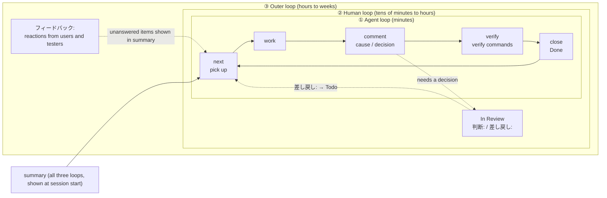

# Where Looptrack fits: what serves each loop

[Guide contents](README.md) · Previous: [Concepts](concepts.md) · Next: [Getting started](getting-started.md)

## The big picture



A text version for viewers that do not render the diagram:

```
+-- ③ Outer loop ---------------------------------------------------+
|  フィードバック: …  (reactions; unanswered ones appear in summary ③) |
|  +-- ② Human loop -------------------------------------------+   |
|  |  In Review → 判断: (to Done) / 差し戻し: (to Todo)          |   |
|  |  +-- ① Agent loop -------------------------------------+  |   |
|  |  |  next → work → comment → verify → close → next …    |  |   |
|  |  +-----------------------------------------------------+  |   |
|  +-----------------------------------------------------------+   |
+-------------------------------------------------------------------+
  The summary at session start shows ①②③ to the agent every time
```

## Features and the loops they serve

| Feature | Loop | What it does |
| -- | -- | -- |
| `next` | ① | Returns the issue you are already working on. If there is none, moves the top ready issue to In Progress and returns its body, acceptance criteria, and links |
| `verify` and the verify-commands section | ① | Runs the commands written in the issue body on your machine and records the result on the issue |
| `close --comment` | ① | Marks the issue Done with the acceptance-check results attached |
| Three-part `summary` | ①②③ | Lists "① current loop", "② waiting for a person", and "③ reactions from outside". The session-start hook shows it to the agent every time |
| In Review | ② | The status for work that needs a human decision. Items waiting more than 48 hours are flagged |
| `判断:` / `差し戻し:` comments | ② | How a person's answer is recorded. The agent uses it to move the issue to Done or Todo |
| `フィードバック:` comments | ③ | How an outside reaction is recorded. It stays "unanswered" until someone responds |
| Project rules | ①② | The server checks status changes (table below) |
| Token tracking | ①②③ | Records the agent's token usage against the issue for each operation |
| Kit hooks | ①② | Detect when the agent drifts (e.g. ends without updating the issue) and push back |

## Project rules

Each project can add rules that the server enforces.
An administrator sets them up (see [Administration](admin.md)).

| Rule | Effect |
| -- | -- |
| Verification required (`verify.require_on_close`) | An issue with a verify-commands section cannot be marked Done unless the latest `verify` against the current body passed completely |
| Token info required (`usage.require_on_close`) | When an agent marks an issue Done or Canceled, the server refuses if the issue has no token info from that conversation |

When something is rejected, the message tells you the next step.
Use an override (`--override "reason"`) only when the user explicitly asks for it.
The reason is recorded on the server.

## Token tracking

CLI write operations and hooks send the agent conversation's token usage to the server.
Usage accumulates per stage, for each operation on the issue (creating it, commenting, changing status, and so on).
`looptrack issue usage show <ID>` shows the breakdown by stage.
You can also aggregate by period and produce a report (PDF).

## Kit hooks (core and loop)

`looptrack issue init` installs the kit into a project.

| Layer | How it is installed | Main contents |
| -- | -- | -- |
| core | Always | The three-part summary at session start, the freshness guard (pushes back if you end after reading an issue without updating it), token tracking, the `/issue` skill |
| loop | The user chooses | Output discipline, working discipline, confirm mode (asking the agent only to check or investigate blocks edits), handoff freshness, iteration discipline with the `/iterate` skill, context size warnings, runaway background process detection, confirmation before changing another repository |

With core alone, loop ① already runs.
Adding loop hands drift detection to hooks, so the person can focus on decisions.
Whether to install loop is the user's call, not the agent's.
